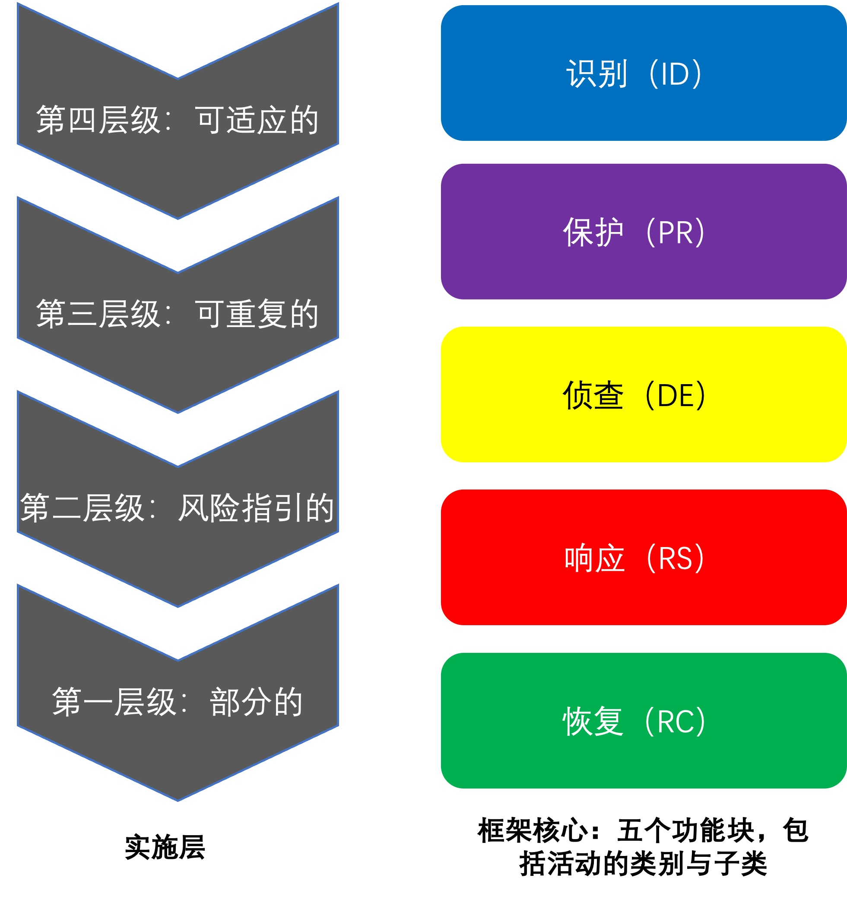
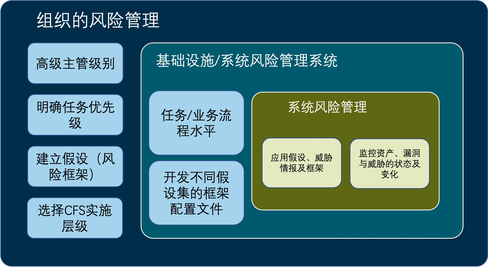
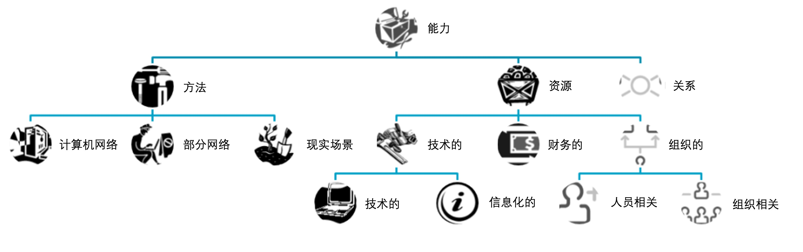
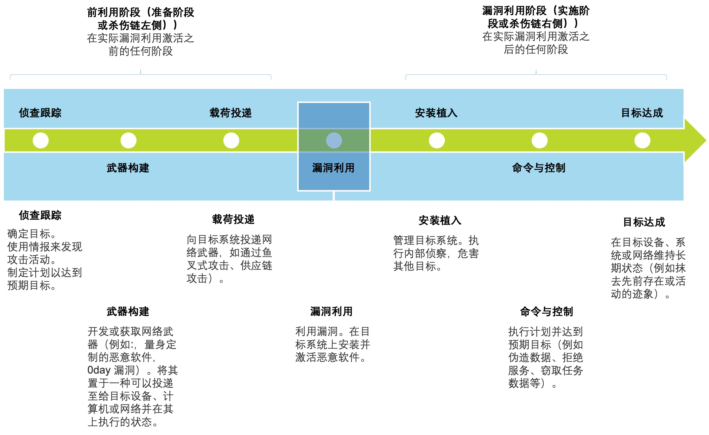

# 2 威胁建模框架和方法

&emsp;&emsp;本节总结了许多威胁建模框架和方法。某些风险建模方法隐式或显式包含在风险管理方法中，这部分将在第2.1节中介绍。某些方法集成在系统设计过程中，这部分将在第2.2节中讨论。最后，一些威胁建模框架旨在支持或利用威胁信息共享，这部分将在第2.3节中介绍。本节中描述的框架和方法并未结合威胁事件，或者仅包含代表性的威胁事件集的起始信息。具体的威胁模型将在第3节中进行描述。 

## 2.1 网络风险管理框架

&emsp;&emsp;几种网络风险管理的框架假定了潜在的威胁模型或威胁模型框架（风险管理是基于对网络资源的依赖，而网络空间可能存在不良行为者）。特别是： 

- 在改善关键基础设施网络安全的NIST框架中，威胁建模是隐式的（请参阅第2.1.1节） 。

- 威胁建模在NIST SP 800-30R1中是明确的，包含在国防部联合任务组（JTF）转型计划(详见章节2.1.2)开发的风险管理视图，并由多个NIST特别出版物(SPs)出版。

- 威胁建模包含在英格兰银行CBEST4框架（在第2.1.3节中讨论）的评估过程中。

&emsp;&emsp;此外，许多网络威胁建模方法具有一些共同点。网络攻击生命周期模型或网络杀伤链模型提供了许多信息。攻击树或攻击图为威胁情景的开发提供了结构化的框架。 

### 2.1.1 NIST改善关键基础设施网络安全的框架

&emsp;&emsp;NIST在2014年2月发布了其“改善关键基础设施网络安全的框架版本1.0” [NIST 2014]。修订版于2018年4月发布[NIST 2018b]。网络安全框架（CSF）定义了一种风险管理的高级方法，以补充关键基础设施领域的组织的网络安全计划和风险管理流程。如图5所示，CSF具有两个主要组件：四个实施层和框架核心。 

 

<b>图5. NIST网络安全框架的风险管理实施层与功能</b>

&emsp;&emsp;在CSF方法中，如图6所示，组织隐式或显式地主张其关于其所面临的风险的假设，包括关于其面临的威胁的假设。高级管理人员会确定任务优先级并确定组织的实施层级。基于此高层级别的指示，任务和业务流程所有者将制定组织的框架——根据框架核心中定义的五个功能块，以及组织的业务需求、风险承受能力和资源，选择和细化活动的类别和子类别。对于组织的系统，风险管理涉及应用组织的风险假设、优先级和框架配置，以及（如果实施层足够高）威胁情报。在系统级别的风险管理还涉及监控系统状态以及资产、漏洞和/或威胁的变化。 

 

<b>图6.NIST网络安全框架的风险管理范围决策模型.jpg</b>

&emsp;&emsp;CSF指出： 

&emsp;&emsp;“网络安全威胁利用了关键基础设施系统日益增加的复杂性和可连接性，使该国的安全、经济以及公共安全与健康面临风险。” 

&emsp;&emsp;CSF没有定义网络威胁建模术语，而是使用以下术语：网络安全威胁、威胁暴露、威胁环境、持续发展的复杂威胁以及网络威胁情报。 

&emsp;&emsp;应该注意的是，在NIST框架中风险管理的三个级别与NIST SP 800-39“管理信息安全风险[NIST 2011]”中定义的三个风险管理级别一致：组织、任务/业务职能、和系统。NIST SP 800-39提供了NIST SP 800-30和NIST SP 800-154草案的组织背景。 

&emsp;&emsp;此外，该框架的核心功能可用于对已识别的威胁缓解措施进行分组和检视。结合NIST SP 800-30R1[NIST 2012]和其他风险流程，它提供了一个通用框架，该框架可以应用于其他出版物，例如IT控制目标（COBIT）（第2.1.4节）和联邦金融机构检查委员会信息安全手册[FFIEC 2016]。 

### 2.1.2 联合特遣部队转型计划制作的出版物

&emsp;&emsp;国防部，情报局（IC）和联邦机构通过NIST创建了联合特遣部队转型计划，以从面向合规性的方法转向网络安全，再到基于风险管理的方法。一些NIST出版物支持此转型，包括NIST SP 800-37 [NIST 2010]、NIST SP 800-39 [NIST 2011]、NIST SP 800-30R1 [NIST 2012]和NIST SP 800-53R4 [NIST 2013]。国家安全系统委员会（CNSS）提供了其他出版物，包括CNSS指令（CNSSI） 1253 [CNSS 2014]。[^1][^2] 

[^1]:在JTF出版物的上下文中，短语“风险管理框架”（RMF）具有各种解释。根据CNSSI 4009 [CNSS 2015]的定义，RMF是“一种用于监督和管理企业风险的结构化方法”。在NIST SP 800-39中定义的风险管理方法中，这种高级别及通用的定义涵盖了各个级别（组织、任务/业务流程和系统）的风险管理。 NIST SP 800-39中定义的风险管理方法使用术语“层”——组织层、任务/业务流程层、系统层。为避免与CSF中定义的实施层混淆，本文（如联邦机构实施指南草案[NIST 2017]）使用术语“级别” 。
[^2]:但是，术语RMF已广泛通过其他方式解释。有些关注其主要目的：作为旨在帮助授权官员（AO）做出接近实时、基于风险的决策的框架。有些倾向于使用RMF术语来表示支持的各种文档（例如NIST SP 800-53、NIST SP 800-39、NISTSP 800-37、NIST SP 800-30R1、CNSSI 1253等），这些文档构成并支撑更广泛的RMF结构。还有一些仅狭义地使用该术语来指代NIST SP 800-37中定义的六步过程。这些使用方式均有效；重要的是上下文。

&emsp;&emsp;NIST SP 800-39中定义的风险管理过程包括四项活动：风险框架、风险评估、风险响应和风险监控。NIST SP 800-39将风险框架定义为“构成组织管理风险方法的一系列假设、约束、风险容忍度和优先级的权衡。”有关威胁源和威胁事件的假设（特别是要解决的对抗策略、技术和程序（TTP）的类型以及对抗特征（例如能力、意图、目标）），隐含或明确定义了组织的威胁模型。该威胁模型在执行风险评估以及更新填充值至风险监控部分时，得以进一步完善与补充。 

&emsp;&emsp;NIST SP 800-30R1提供了代表性的威胁模型，其作为整体风险评估方法的一部分。该威胁模型包括： 

- 威胁源分类（表D-2），附有对抗性威胁（能力、意图和目标）和非对抗性威胁（影响范围）的特征。

- 一组具有代表性的对抗性威胁事件(表E-2)，其使用网络活动(即网络攻击生命周期)的结构组织，以及一组具有代表性的非对抗性威胁事件(表E-3)。

- 诱发条件的分类（即影响威胁事件发生或导致不利后果的可能性的环境因素）（表F-4）。由于漏洞的特征多种多样，因此NIST SP 800-30R1未包括漏洞分类法。

&emsp;&emsp;NIST SP 800-30R1并未规定此威胁模型（也没有规定它属于的风险模型）。但是，NIST SP 800-30R1指出： 

&emsp;&emsp;“为促进评估结果的相互交流，特定于组织的风险模型包括或可以转化为附录中定义的风险因素（即威胁、脆弱性、影响、可能性和诱发条件）。 ” 

### 2.1.3 CBEST情报主导的网络威胁建模

&emsp;&emsp;CBEST威胁建模方法[BOE 2016]是英格兰银行在2016年发布的网络威胁情报驱动的系统评估和测试框架的子组件。它概述了网络威胁参与者的目标分析模型，用于实现这些目标的能力以及操作的方法和模式。该模型旨在用作进行网络威胁评估的模板，以定义一组现实的和具有威胁信息的测试方案。CBEST方法专注于识别特定威胁参与者及其常见攻击模式，以进行可行的网络侦察。 

&emsp;&emsp;与大多数模型相比，使用CBEST方法的分析师将利用现有的尽可能多的情报，对每个特定威胁参与者的身份和动机进行更深入的分析，例如，研究影响可能行为的地缘政治和社会文化因素。该方法从资源、技能水平和复杂程度、持久性，对被评估目标系统的潜在访问权限的指标以及风险敏感性的证据等方面来描述威胁行为者的能力。它模拟了有关威胁行为者操作阶段的知识；TTP；应对发现的对策；时机；和对应的活动。CBEST方法旨在使分析人员在获得足够的网络威胁情报数据的情况下，能够得出足够精确，足以预测可能的威胁事件的威胁参与者模型。尽管通常无法获得这种级别的威胁情报，但CBEST方法试图根据给定的信息来生成最现实的威胁情景。 

&emsp;&emsp;CBEST方法包括对威胁情景的预期内容的明确指导。CBEST中的关键建模架构包括威胁实体目标导向（包括身份、动机和意图），能力和作案手法。 

### 2.1.4 COBIT 5和Risk IT

&emsp;&emsp;信息及相关技术的控制目标（COBIT）是用于IT环境治理的框架，其重点是控制。COBIT5由信息系统审计与控制协会（ISACA）于2012年4月发布（http://www.isaca.org/cobit). COBIT基于国际标准化组织（ISO）标准的组成部分，其中包括将用于IT公司治理的ISO 38500模型和与ISO 15504一致的COBIT流程能力评估模型结合在一起。安全控制基于ISO 27001系列控制目标[ISO 2013]。其包括与运营操作，实施指南，度量和风险管理相一致的评估考虑事项。 

&emsp;&emsp;COBIT随附有用于管理IT业务风险的Risk IT框架[ISACA 2009]。Risk IT由风险模型和流程模型组成；其中流程是为风险治理、风险评估和风险响应的领域定义的。Risk IT中风险评估的基础模型不是安全风险模型，但确实将安全风险确定为需要考虑的一类风险。其根据威胁类型（包括恶意威胁）、参与者、事件类型（即影响类型）、受影响的资产或资源以及时间来描述风险场景。ISACA提供了制定风险场景的指南，包括涵盖20种风险类别的60个示例[ISACA 2014]。此外，Risk IT风险评估框架中的方案规划方法还可以在单个组织或系统视图之外进行风险考虑。 

### 2.1.5 主题框架和方法论

&emsp;&emsp;如第1.1节所述，对手的特征和行为是网络威胁讨论中的关键主题。一些框架和方法论着重于特定主题，而不是描述所有的特征和行为。以特征为重点的框架包括由国防科学委员会（DSB）弹性军事系统和网络准备工作组开发的多层威胁模型。以行为为中心的框架和方法包括网络攻击生命周期或网络杀伤链模型、攻击树或攻击图建模以及内部威胁建模。 

#### 2.1.5.1 DSB六层威胁等级

&emsp;&emsp;DSB工作组关于弹性军事系统和高级网络威胁的报告[DSB 2013]定义了威胁等级，主要基于潜在攻击者的能力。在该层次结构中，第一层和第二层利用已知的漏洞；第III层和IV层发现新的漏洞；第五层和第六层会产生新的漏洞。其他区分因素包括攻击者的知识或专长，资源，操作规模，代理使用，时间范围以及与犯罪分子、恐怖分子或民族国家实体的配合或赞助。 

&emsp;&emsp;威胁层次结构用于促使和构建风险管理策略的建议。风险表示为威胁、脆弱性和后果的函数。威胁具有意图和能力的特征，对应的策略可以阻止和破坏。漏洞具有固有性和引入性的特征，对应的策略是进行防御和检测。结果具有可修复和最终的特征，并具有对应的恢复和丢弃策略。 

#### 2.1.5.2 网络准备对手特征框架

&emsp;&emsp;MITRE公司的Cyber Prep方法[Bodeau 2017]利用组织预期的网络对手的特征来激发针对网络威胁准备的建议。Cyber Prep专门针对组织级别的风险管理。Cyber Prep框架在三个领域定义了组织准备的十四个方面：治理、运营以及架构与工程。不同的对手特征激发了备战的不同方面。对手的特征包括目标、行动范围或规模、行动时间表、持续性、隐匿性、所使用的网络攻击生命周期的阶段、寻求或产生的网络影响以及能力。除了图7中所示的建模结构外，Cyber Prep还确定了一组代表性的高级攻击场景。组织的特征——其业务、资产以及在更大的网络生态系统中的角色——使得不同的场景对具有不同特征的对手具有或多或少吸引力[Sheingold 2017]。 

 

<b>图7.Cyber Prep框架.jpg</b>

&emsp;&emsp;Cyber Prep威胁建模框架建立在描述和分析网络战略（DACS）框架的基础上，该框架可以在任何范围或规模上应用[Bodeau 2014]。DACS提供了有关功能的更多详细信息，如图8所示。开发关于对手能力的情报或对对手能力产生影响的战略可以集中于这些属性中的一个或多个。 

 

 

<b>图8.对手能力的属性.jpg</b>

#### 2.1.5.3 网络攻击生命周期或网络杀伤链模型[^3]:

[^3]:此部分改编自[Bodeau 2013]。

&emsp;&emsp;高级别的网络对手对组织或任务的攻击或入侵是多阶段的，并且会在几个月或几年的时间内发生，这一认识促使了多阶段模型的发展，可用于“分类”或描述攻击事件。这种多阶段模型通常用军事术语称为“网络杀伤链”；“网络攻击生命周期”则是一个非军事术语的描述。洛克希德·马丁公司（Lockheed Martin）开发了最初的网络杀伤链模型[Cloppert 2009]。 

&emsp;&emsp;网络攻击生命周期模型最常见的定义是对企业IT和命令与控制（C2）系统的外部攻击。NIST SP 800-30R1和2013 DoD网络安全发展测试与评估指南（DT＆E）[DoD 2013]使用了七个阶段的网络攻击生命周期模型，如图9所示。[^4] 

[^4]:最新版的《国防部网络安全测试和评估指南》使用了不同的版本。当前版本[DoD 2018]确定了四个阶段-准备、获得访问通道、传播和影响-两类活动（侦查和C2）适用于所有四个阶段。

&emsp;&emsp;不同的攻击生命周期很常见。大多数攻击者将敏感信息的泄漏作为目标。例如，一个高级研究与开发活动（ARDA）研讨会设计了一个版本，以描述内部人员的活动[Maybury 2005]：侦察跟踪、获取通道、构建防御、漏洞利用、通信、操纵处理、提取与渗透以及反情报。雷神公司使用了六阶段模型：足迹、扫描、枚举、访问权限、升级特权和盗版。[^5]Dell 安全工作室识别了十二个阶段：定义目标、查找和组织同伙、构建或获取工具、研究目标基础架构/员工、探测测试、部署、初始入侵、启动出站连接、扩展访问权限和获取凭据、巩固立足点、泄露数据以及掩盖痕迹、持续保持隐匿状态[SecureWorks 2016]。  

[^5]:首次提供此模型的白皮书不再可用。但是，该模型包含在2013年8月20日授予的专利US 8516596 B2“网络攻击分析”中。请参阅http://www.google.com/patents/US8516596.

&emsp;&emsp;其他网络攻击生命周期（如图9所示），并未指定攻击者的具体目标，因此使直接影响组织及其任务（例如，通过拒绝服务，数据损坏或篡改）的网络攻击成为可能。微软研究人员确定了十种“基本类型”的行动：侦察、开始、进入、据点、横向移动、获取控制权、获取目标、执行、隐藏和维持以及撤退[Espenschied 2012]。 Mandiant [Mandiant 2013]描述了由初始侦察、初步入侵、建立立足点、权限提升、内部侦查、横向移动和保持状态（可以循环重复）和完成任务组成的攻击生命周期。CIS社区攻击模型定义了9个阶段：初始侦查、获取/开发工具、传递、初始入侵、滥用/升级权限、内部侦查、横向移动、建立持久性和执行任务目标[CIS 2016]。国家网络安全中心（NCSC）定义了四个阶段的流程：调查、投递、破坏和影响[NCSC 2016]；这与第2.3.4节中讨论的ODNI网络威胁框架中确定的四个阶段相似。英国支付部确定了十二个步骤：定义目标、查找和组织帮凶、构建或获取工具、研究目标基础架构/员工、探测测试、部署、初始入侵、启动出站连接、扩展访问权限并获取凭证、巩固立足点、泄露数据以及掩盖痕迹并保持隐匿状态[Payments UK 2014]。 

 

<b>img/图9.网络攻击生命周期.jpg</b>

&emsp;&emsp;攻击生命周期或杀伤链的概念已扩展到威胁，除了那些利用组织系统在网络空间中暴露的威胁之外，还包括内部威胁，对工业控制系统和其他网络物理系统的威胁以及供应链威胁。联邦调查局（Reidy 2013）定义了一个由四个阶段组成的内部威胁杀伤链——招募/引爆点、搜索/侦察、采集/收集和渗透/行动，并已被[TripWire 2015]采纳和扩展[ZoneFox 2015]。Assante 2015定义了一个工业控制系统（ICS）的威胁杀伤链版本，其分为两个阶段（网络入侵准备和执行、以及ICS攻击开发和执行），每个阶段包括了多个阶段。[Hahn 2015]开发出一种用于网络物理系统（CPS）的版本，该版本考虑了CPS的三层（网络、控制和物理）。这些阶段包括侦察（跨越所有三层），武器化（跨越网络和控制），投递（网络）、网络执行（网络）、干扰控制（控制）和实现物理目标（物理）。 DSB网络供应链特别工作组[DSB 2017]制定了四个阶段的杀伤链：情报与计划、设计与创建、插入和实现。[Shackleford 2015]提供了一个更详细的供应链攻击生命周期，其描述了两种不同的攻击向量：物理攻击和虚拟攻击。 

#### 2.1.5.4 使用攻击树或攻击图进行威胁建模

&emsp;&emsp;攻击树或攻击图是一种完善的方法，可用于开发威胁情景以进行风险评估或网络作战。可在[Kordy 2014]和[Bodeau 2013]的附录B.1.2中找到关于使用有向无环图的模型和方法的调查研究。除了此处描述的变体和[Beyst 2016]中描述的其他历史变体外，某些产品（例如， http://threatmodeler.com）或来自广泛研究工作的原型工具均可用于生成攻击树或攻击图。面向任务的风险和设计分析（MORDA）方法[Buckshaw 2005]描述了攻击树的使用，并考虑了攻击者的偏好，将其作为风险评估的一部分。NIST SP 800-30R1可适应但不指导攻击树的使用。 

#### 2.1.5.5 为DRDC开发的威胁特征描述框架

&emsp;&emsp;加拿大国防研究与发展局（DRDC）对网络威胁建模的最新技术进行了调查[Magar 2016]。该报告（类似本报告）包括一个建议的初始网络威胁建模框架。该框架旨在用于开发加拿大武装部队（CAF）网络威胁模型，并在DRDC ARMOUR[^6]平台上进行演示。该框架确定了四个关键要素：对手、攻击、资产和影响。对手属性包括类型、动机、承诺和资源。攻击属性包括投递机制（本地访问、远程投递、分布式投递或社会工程）、工具、自动化和操作。资产属性包括配置文件、容器（硬件、软件、对象或人员）和漏洞。影响属性包括网络影响和对军事活动的影响。 

[^6]:ARMOUR不是首字母缩写词，而是指DRDC自动化计算机网络防御程序。

#### 2.1.5.6 内部威胁建模

&emsp;&emsp;内部威胁建模包括旨在识别内部活动指标的内部行为模型[Costa 2016]。计算M＆S是一种关键的分析方法[Moore 2016]。内部威胁建模还包括旨在预测内部人员是否以及如何成为恶意因素，以及分析和预测组织行为对内部人员行为的影响的模型。这种预测分析和建模强调了心理社会因素[Greitzer 2013]。通过M＆S进行的内部威胁建模不属于本文调查的范围。 

&emsp;&emsp;内部人员在组织的网络资源内或之上活动，因而内部威胁建模与网络威胁建模存在着重叠。但是，在某些方面，两种形式的建模是截然不同的：首先，网络威胁建模考虑了分层架构中所有层上的外部威胁源和恶意网络活动。内部威胁建模仅考虑外部威胁参与者在影响或唆使内部人员方面做出的努力，并专注于单个用户可以采取的行动。其次，内部威胁建模可以包括纯粹的非网络威胁情景（例如，盗窃实物或非电子形式的信息） 。 

## 2.2 支持设计分析和测试的威胁建模

&emsp;&emsp;一些高度结构化的威胁建模方法被开发出来用于系统设计和开发过程，以促使和支持系统设计决策。其中包括NIST SP 800-154草案中的建模方法； Microsoft创建的包括欺骗、篡改、抵赖、信息泄露、拒绝服务、特权提升（STRIDE）方法和潜在损失、重现性、可利用性、受影响的用户和可发现性的（DREAD）方法；卡内基梅隆软件工程学院的可操作的关键威胁、资产和漏洞评估（OCTAVE）方法；以及英特尔和洛克希德·马丁公司所使用的结构化方法。此外，也使用结构较简单的头脑风暴方法[Steiger 2016，Shull 2016]，但下文不再讨论。 

### 2.2.1 NIST特别出版物草案800-154，以数据为中心的系统威胁建模指南

&emsp;&emsp;NIST在2016年发布了新的威胁建模指导文件草案，该文件着重于识别和区分系统中针对特定类型数据的威胁[NIST 2016]，以便为保护数据提供信息和评估方法。在审查和修订之后，该指导文档可能会更改。NIST SP 800-154（DRAFT）提出了以下方法。 

&emsp;&emsp;标识系统边界，并标识和保护每种特定类型的数据，包括授权的位置、合法的数据流转、数据/应用/服务保护要达到的安全目标、以及被授权以与安全目标相关的方式访问数据的用户。 

&emsp;&emsp;然后针对每种数据类型和位置，列出适用的攻击向量。调整安全控制措施以改善数据保护，并针对每个攻击向量评估其有效性。同时，围绕资源或对功能、可用性和性能的影响，对安全控制成本进行描述。 

&emsp;&emsp;如上述的，针对数据类型和对策的攻击载体构成了威胁模型，通过对威胁模型进行整体分析，以确定哪些对策可以最好地降低跨数据类型和攻击载体的风险。本文提出了一些用于评分的方法，但未详细说明。 

### 2.2.2 STRIDE

&emsp;&emsp;身份假冒、篡改、抵赖、信息泄露、拒绝服务、特权提升（STRIDE）是为微软公司内部使用开发的[Kohnfelder 1999]，作为其推动生产更安全的软件的一部分。因此，它从软件开发的角度来考虑威胁。而后，它在社区中广泛使用，并嵌入到宽松的威胁建模方法中[Shostack 2014]。尽管有时被称为威胁模型或威胁建模框架，但STRIDE主要用作对需考虑的威胁向量的一般类型进行分类，以帮助分析人员确定完整的威胁模型，例如使用攻击树分析[Xin 2014]。STRIDE没有直接处理详细节级别或特定的攻击方法。它可以应用于软件组件、企业架构或要保护的特定资产。使用STRIDE进行威胁建模首先要回答“您要构建什么样的组件和信任边界？”，用以识别跨越信任边界的交互，此交互可能给攻击者带来机会。模型会假定潜在的对手及其目标。然后，将STRIDE助记符的攻击向量类别应用于受保护系统或组件一部分的特定的接口、功能、数据对象、软件技术。根据调查结果，分析师或软件开发人员可能会确定需要修复的错误，或者得出结论，认为存在某种攻击向量需要以其他方式加以缓解（例如，可能涉及添加单独的安全组件或产品、策略调整或功能取消。） 

### 2.2.3 DREAD

&emsp;&emsp;DREAD也是由Microsoft创建的，用于其软件开发过程中以提高其产品的安全性[Howard2003]。首字母缩写词代表损失、（攻击）的可靠性（有时描述为可重现性）、可利用性、受影响的用户和可发现性。DREAD提供了一种方案，通过该方案可以评估和区分使用STRIDE或其他方法确定的威胁向量。每个元素的得分以1到10的分值来确定。每个威胁向量在这五个元素上得分并取平均值，然后可以将其与其他威胁向量的严重程度和可能性进行比较。 

&emsp;&emsp;因此， DREAD已成为除了威胁建模之外的某种风险评估方法。但是，作为软件供应商环境中软件开发方法的一部分， DREAD不能直接解决任何特定企业环境中固有的特定风险及其面临的威胁。 

&emsp;&emsp;Microsoft一直认为DREAD过于主观，自2010年起就停止在其内部软件开发生命周期中使用DREAD 模型[Howard 2014]；但是，其仍在社区中流通，并作为威胁和风险建模元素的建议。 [Leblanc 2007]开展了一些讨论，包括关于DREAD的批评、其可能如何有用，并提供了对计分方案进行修改调整的建议。 

### 2.2.4 运营关键威胁，资产和漏洞评估（OCTAVE）

&emsp;&emsp;卡耐基梅隆软件工程学院的OCTAVE方法最初于1999年9月发布。其最新版本为Allegro v1.0，该版本于2007年6月发布[Caralli 2007]。OCTAVE/Allegro的目标是在不需要广泛的风险评估知识的情况下，通过关注信息资产的如何被使用、存储、运输和加工以及如何暴露于威胁、漏洞及破坏，提供更可靠的风险评估结果。 

&emsp;&emsp;该方法包括八个步骤：制定与组织驱动一致的风险衡量标准；分析关键信息资产以识别安全要求；确定资产的存储、运输或处理位置；确定重点关注领域；在这些领域内识别威胁；识别风险；分析风险；并选择缓解方法。 

&emsp;&emsp;OCTAVE/Allegro方法的威胁建模部分包括确定关注区域的（典型威胁，特别是在威胁源及其对信息资产的影响方面）和开发威胁场景，并以可视化方式将其表示为威胁树。其识别了四类威胁，其与攻击树的最高节点相对应：使用技术手段的攻击者、使用物理手段的攻击者、技术问题和其他问题（例如自然灾害）。 OCTAVE/Allegro威胁建模方法中威胁的关键属性包括参与者、资产（威胁目标或可能影响的对象）、访问路径或手段，动机[[7\]](#_ftn7)和结果（披露、修改、破坏、损失或中断）。 

### 2.2.5 英特尔的威胁代理风险评估（TARA）和威胁代理库（TAL）

&emsp;&emsp;英特尔公司于2009年12月发布了其威胁因素风险评估（TARA）方法论[英特尔2009]，该方法旨在将可能的信息安全攻击提炼成仅最有可能发生的那些风险。其目的是确定寻求合理可实现并可能造成损失的威胁因素。该方法论可以确定哪些威胁因素构成最大的风险，其期望完成的任务以及将采用的可能方法。通过将这些方法与现有漏洞和控制措施进行交叉引用，查明最容易暴露的区域。然后，TARA固有的安全策略将重点放在这些领域上，以最大程度地减少工作量，同时最大程度地发挥效果。 

&emsp;&emsp;英特尔还发布了威胁因素库[英特尔2007]，以开展企业开发特定于组织的威胁因素特征的工作。该库白皮书的站点在2015年进行了更新。威胁代理库（TAL）使用八个关键属性或参数定义了22个原型：意图、访问、结果、限制、资源、技能、目标和可见性。英特尔随后修改了关键参数列表以包含动机[Intel 2015]。此外，英特尔还确定了动机参数的10个要素（意识形态、胁迫、恶名、个人满意度、组织收益、个人财务收益、不满、意外、支配和不可预测性），并修改了其模型，以便每个因素可以拥有多种动机（定义动机、合作动机、从属动机、约束性动机和个人动机）。在结构化威胁信息表达标准（STIX™）中，威胁动机域对象的定义中已经包含了多种动机的概念（请参阅第2.3.1节）。 

### 2.2.6 IDDIL/ATC

&emsp;&emsp;IDDILL/ATC是一个助记符：标识资产；定义攻击面；分解系统；识别攻击向量；列出威胁者；分析与评估；分类；控制。洛克希德·马丁（Lockheed Martin）的IDDIL/ATC方法论[Muckin 2015]为应用其网络杀伤链模型及其STRIDE变体（STRIDE-LM，增加了横向运动）和攻击树提供了结构化的流程。使用IDDIL/ATC，分析人员可以开发图形化的系统威胁模型。关键建模结构包括资产、威胁参与者和攻击向量。威胁配置文件（威胁、攻击和相关特征的表格摘要）标识了资产或威胁对象；威胁类型（例如STRIDE-LM；对机密性、完整性、和/或可用性的威胁）；攻击面；攻击向量；威胁者；结果条件；漏洞和控制。已发布出版的材料提供了代表性的例子。其他详细信息包含在其专有工具中。 

## 2.3 威胁建模以支持信息共享和安全操作

&emsp;&emsp;如第2.1节所述，威胁信息共享是许多网络风险管理方法中不可或缺的，包括CSF中较高的实施层，JTF风险管理过程中的风险监视以及CBEST。NGCI Apex计划特别关注三种关注威胁信息共享的建模框架：STIX，PRE-ATT＆CK™和OMG威胁风险标准计划。此外，国家情报局局长办公室（ODNI）颁布的网络威胁框架（CTF）提供了一种对网络威胁事件进行分类、描述和信息共享的方法。这已在国家安全局（NSA）中央安全服务（CSS）网络威胁框架中详细阐述。 

### 2.3.1 STIX™

&emsp;&emsp;STIX™（结构化威胁信息表达）是一种用于捕获和共享网络威胁信息的结构化语言[Barnum 2014]。STIX已转至结构化信息标准促进组织（OASIS）。[^8]STIX可以共享有关网络威胁以及可以防御威胁活动的行动路线的相关信息。2017年1月，OASIS网络威胁情报（CTI）技术委员会批准了STIX 2.0的委员会规范草案[OASIS 2017]； STIX 2.1的规范正在制定中。企业可以使用STIX和TAXII™（指标信息的可信自动化交换）共享威胁情报。 

[^8]:STIX标准可从github获得(https://stixproject.github.io/).

&emsp;&emsp;STIX域模型定义了数据结构以表示或描述对手和对手活动。STIX域对象包括威胁主体、恶意软件、工具、攻击模式（可以参考3.1.2节中讨论的通用攻击模式枚举[CAPEC™]）、攻击活动（如一系列攻击者的行为、使用的攻击模式、恶意软件，以及/或工具集）、和威胁常用工具集。威胁主体的对象具有几个可选的关联属性，包括目标、复杂程度、资源级别、主要动机、次要动机和个人动机。攻击模式、恶意软件和工具集都是以TTP的形式描述。有关攻击者采取行动的原因及其如何组织的信息，将通过威胁主体、攻击工具集和攻击活动领域对象进行描述。STIX领域模型的其他部分包括可观察性、指标和处置方法。杀伤链阶段是攻击模式、指标、恶意软件和工具的可选属性。STIX没有指定一组杀伤链阶段，而是允许其用户指定他们正在使用的杀伤链模型。 

&emsp;&emsp;Payments UK的白皮书建议将STIX及其传输协议TAXII作为标准技术报告的（STRUM）的格式[Payments UK 2014]。 

### 2.3.2 OMG威胁/风险标准倡议

&emsp;&emsp;对象管理小组（OMG）已针对操作威胁和风险模型开发了征求建议书（RFP） [OMG 2014]，该模型可用于联合现有风险模型或部分模型。概念模型将具有基于国家信息交换模型（NIEM）的信息交换格式以及对STIX的明确映射。威胁与风险社区创建于http://threatrisk.org/drupal/，并在RFP的开发过程中继续完善此模型。RFP对操作风险的定义如下： 

&emsp;&emsp;“操作风险是由于不确定性而造成的对组织或公司的不利影响，这些不确定性可能与由故意或非故意的操作威胁而导致的系统/供应链环境崩溃、人员受伤或流程失败相关。操作风险的主要影响之一是无法按计划进行操作。” 

&emsp;&emsp;网络风险是操作风险的关键类别。RFP标识了许多与威胁建模相关的术语，包括威胁、威胁源、威胁参与者、意外事件、战术、技术、规程、利用目标、目标和攻击活动。扩展草案提供了更多详细信息，包括分类和属性关系。这些在https://slideplayer.com/slide/9121179/的幻灯片60-65中以图表形式表示。 

&emsp;&emsp;与STIX的兼容性是满足RFP的任何模型都必须具备的特性。 

### 2.3.3 PRE-ATT&CK™

&emsp;&emsp;PRE-ATT＆CK™（前利用阶段的专业策略、技术和常识 [ATT&CK] [^9]）是一个新兴的框架，用于对网络攻击生命周期的早期阶段的敌手活动进行分类和描述[MITRE 2016b]。框架目前定义了十七种高级策略，主要包含了企业外部的技术。策略可以是技术、人为或组织上的；示例包括人员信息收集、对手OPSEC（运营安全）、角色开发和测试能力。网络防御者可以使用PRE-ATT＆CK来确定网络威胁情报数据的获取和分析的优先级。 

[^9]:ATT＆CK在3.1.1节中讨论。

&emsp;&emsp;漏洞利用前的对抗活动，例如从Internet上收集有关潜在攻击目标的信息，大部分是在潜在受害者的权限范围之外执行的，这使得防御者很难发现。但是，PRE-ATT＆CK可以提供一个通用的词典，以使网络防御能够了解、检测、缓解和共享整个FSS上敌手活动的信息，然后可以将其运用到更具主动性的预测分析能力，以支持归因和防御响应的相关要素。 

### 2.3.4 Cyber Threat Framework

&emsp;&emsp;2017年3月，ODNI发布了其网络威胁框架（CTF） [ODNI 2017]，其中包括使用指南和词典。CTF最初旨在通过为发布的威胁报告中的信息提供通用框架来支持威胁信息共享。然而，其描述和分类对手活动的方法还支持分析、高层决策、趋势和差距分析。如表1所示，CTF定义了对手行动的四个主要阶段：能力准备、初始接触、驻留扩散和影响达成。每个阶段的行动都有明确的目标。每个动作都有一个或多个指标。目标和具有代表性的动作示例均包含在已发布的词典中。CTF材料中使用的其他术语还包括威胁参与者和威胁参与者资源。 

**表格1.ODNI 网络威胁框架**

| **层次**                                    | **外部行动**                                                 |                                                            | **内部行动**                                                 |                                                              |
| ------------------------------------------- | ------------------------------------------------------------ | ---------------------------------------------------------- | ------------------------------------------------------------ | ------------------------------------------------------------ |
| **1：阶段**                                 | 能力准备                                                     | 初始接触                                                   | 驻留扩散                                                     | 影响达成                                                     |
| **2：目标**                                 | 活动计划 组织研究与分析  *开发资源与能力* 获取受害者详细信息 完成准备 | 实施能力 与预期受害者的交互 漏洞利用 恶意投递能力 | 建立可控访问渠道 隐匿 目标扩展 精准目标 建立持久化驻点 | 启用其他操作 拒绝访问 获取数据 更改数据或/和终端、网络或系统行为 损毁硬件/软件/数据 |
| **3：行动**  **（作为斜体标识目标的范例）** | 资源投入 能力建设 合作关系建立                         | 说服被攻击方按预期开展危险行为（例如实施社会工程）         | 权限提升   横向移动                                       | 建立C2节点 僵尸网络攻击                                   |
| **4：指标**                                 | [由分析用户补充]                                             |                                                            |                                                              |                                                              |

 

&emsp;&emsp;图9中描述的CAL中的阶段对应CTF的阶段或目标层次。Recon对应于组织研究和分析并获取受害者特定的知识。投递对应于初始接触。控制对应于驻留扩散。执行对应于拒绝访问、获取数据，更改数据和损毁硬件/软件/数据。保持状态对应于启用其他操作。PRE-ATT＆CK中的类别对应于CTF中的目标或行动层次。

&emsp;&emsp;2018年3月，国家安全局发布了NSA/CSS技术网络威胁框架的版本一 [NSA 2018]。该报告旨在提供“标准定义的基准，可作为美国政府与合作伙伴和利益相关方在讨论整个对手生命周期中的对手活动时的参考”。NSA/CSS CTF将ODNI CTF与ATT＆CK集成在一起。它定义了五个阶段（管理、初始接触、驻留扩散、影响达成和持续驻留），每个阶段的目标以及与每个目标相关的多个行动（目前已描述超过200多个行动）。

------

