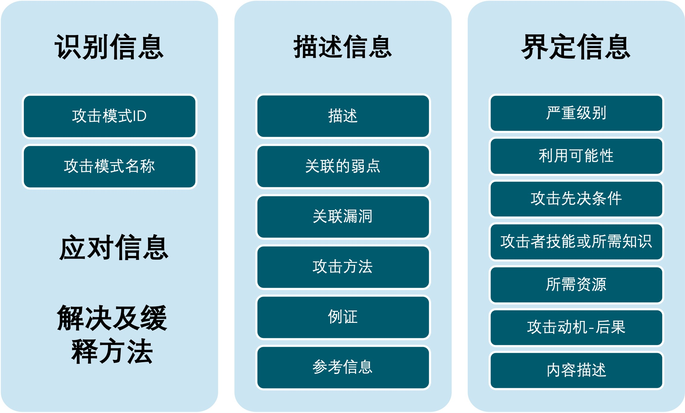
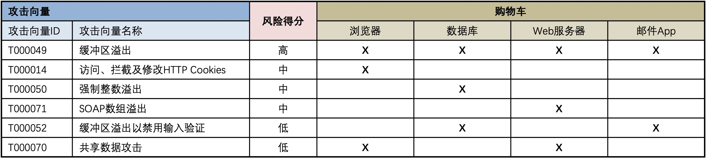

# 3 特定威胁模型

&emsp;&emsp;本节描述了几种特定的威胁模型，包括对对手战术、技术和程序（技战术）的具体描述。第3.1节仅针对对手可能采用的特定技术模式进行了描述，而第3.2节描述了那些明确包含了企业或系统的模型的技术，对手TTPs可能针对该模型应用。 

&emsp;&emsp;虽然可以通过第2节中描述的建模框架之一开发威胁模型，但通常并不太采用这种方式。实际上，本节中的威胁模型是根据它们的不同目的而形成的，而且没有将第2节中的方法实例化。某些威胁模型是面向企业的，而某些威胁模型则侧重于描述威胁参与者针对技术环境所采用的技术。对于企业而言，虽然经常引用NIST SP 800-30R1中的指南，且指南中也在其广泛的附录中提供了有用的威胁信息，但组织通常会采用适合其特定组织过程和建模目标的混合或内部开发的方法。 

## 3.1 非面向企业的以技术为核心的威胁模型

&emsp;&emsp;非面向企业的以技术为中心的威胁模型为通用技术环境中的对手能力和攻击技术的模型。这些模型未包含威胁者可能针对企业的相关信息，包括企业的网络和系统架构、数据资产或目标。 

### 3.1.1 对抗策略、技巧和常识（ATT＆CK™）

&emsp;&emsp;对抗策略、技术和常识（ATT＆CK™，[MITRE 2015]）是一个框架，用于描述对手在企业网络内操作时可能采取的行动。它提供了入侵后攻击者行为的详细特征，即在通过成功利用漏洞达成入侵后的行为。ATT＆CK已对在Microsoft Windows环境中运行的攻击操作进行了填充，将来计划扩展至其他操作系统环境。ATT＆CK旨在通过详细介绍实施高级持久威胁（APT）的攻击者，在内网操作时所运用的针对攻击目标的初始入侵（以及后利用和植入）的TTP，来帮助考虑网络防御策略的优先级别。 

&emsp;&emsp;表2中列出了ATT＆CK的十种战术类别，它们对应至七阶段网络攻击生命周期[MITRE2012]或网络杀伤链[Hutchens 2010]的后期阶段（控制、维持和执行）。每个类别都列出了敌方可以用来执行该战术的技术清单，包括技术描述、指标、有用的防御性传感器数据、检测分析和潜在的缓解措施。某些技术可用于不同目的，因此会出现在多个类别中。 

&emsp;&emsp;随着新技术的发展， ATT＆CK继续被扩充和更新。如2.3.4节所述，NSA/CSS CTF的某些部分来自ATT＆CK。 

<b>表2.ATT&CK策略分类</b>

<table>
  <tr>
  	<th>策略</th>
  	<th>序号</th>
  	<th>描述</th>
  </tr>
  <tr>
    <td><b>持久化</b></td>
    <td>51</td>
    <td>对系统的任何访问、操作或配置更改，使对手在该系统上能持久存在 例如：Bootkit、Hypervisor</td>
  </tr>
  <tr>
    <td><b>特权提升</b></td>
    <td>27</td>
    <td>允许对手在系统或网络上获得更高级别权限的操作的结果 例如：DLL入侵、Web shell</td>
  </tr>
  <tr>
    <td><b>防御绕过</b></td>
    <td>34</td>
    <td>对手用来逃避侦查或躲避其他防御的技术 例如：二进制填充、文件删除</td>
  </tr>
  <tr>
    <td><b>凭据访问</b></td>
    <td>18</td>
    <td>可以访问或控制企业环境中使用的系统、域或服务凭据的技术 例如：凭证转储、输入捕获</td>
  </tr>
  <tr>
    <td><b>发现</b></td>
    <td>17</td>
    <td>允许对手获得系统和内部网络信息的技术 例如：网络服务扫描、查询注册表</td>
  </tr>
  <tr>
    <td><b>横向移动</b></td>
    <td>17</td>
    <td>使对手能够访问和控制网络上的远程系统的技术，可以（但不一定）包括在远程系统上的执行工具 例如：哈希传递攻击、远程管理服务（WinRM）</td>
  </tr>
  <tr>
    <td><b>执行</b></td>
    <td>25</td>
    <td>在本地或远程系统上执行对手控制代码的技术 例如：PowerShell、Windows管理体系结构组件（WMI）</td>
  </tr>
  <tr>
    <td><b>收集</b></td>
    <td>13</td>
    <td>在目标网络进行数据泄露前的信息识别与收集的技术，如识别敏感文件 例如：音频捕获、剪贴板数据</td>
  </tr>
  <tr>
    <td><b>外泄</b></td>
    <td>9</td>
    <td>导致或帮助对手从目标网络中转移文件和信息的技术 例如：加密数据、计划传输</td>
  </tr>
  <tr>
    <td><b>命令与控制</b></td>
    <td>19</td>
    <td>描述对手在目标网络中如何在其控制下进行系统通信 例如：数据编码、非常规端口使用</td>
  </tr>
</table>

  

### 3.1.2 常见攻击模式枚举和分类（CAPEC™）

&emsp;&emsp;通用攻击模式枚举和分类（CAPEC™）提供了公开可用的攻击模式目录，以及综合模式和类别分类（https://capec.mitre.org）。攻击模式是“对易受攻击的网络功能的攻击所使用的常见元素和技术的描述”。每种模式都定义了攻击者可能面临的挑战，提供了用于应对挑战的常用技术的描述，并提出了缓解实际攻击的推荐方法。攻击模式有助于以有意图的方式对攻击进行分类，以提供一种连贯一致的方式来指导设计人员和开发人员了解其系统如何被攻击以及该如何有效防御。图10说明了CAPEC中的攻击模式元素。 

 

<b>图10.CAPEC模型.jpg</b>

### 3.1.3 Web应用程序威胁模型

&emsp;&emsp;Web应用程序安全联盟（WASC）对Web应用程序的弱点和威胁进行了分类[WASC 2010]。它的34种攻击类别包括例如缓冲区溢出、跨站脚本攻击和拒绝服务攻击，弱点类别包括输入处理不当和功能滥用。虽然WASC的分类工作处于休眠状态，但这些类仍然在开放式Web应用程序安全项目（OWASP） WASC Web黑客事件数据库中使用，该数据库在不断更新中。[^1]OWASP识别了12种Web应用程序攻击类别，这些类别提炼了WASC定义的攻击类别。[^2]OWASP的成果体现在攻击模拟与威胁分析过程（PASTA）的威胁建模方法中[UcedaVelez 2015]。 

[^1]:请参阅https://www.owasp.org/index.php/OWASP_WASC_Web_Hacking_Incidents_Database_Project.
[^2]:请参阅https： www.owasp.orggindex.phpp类别：攻击。

&emsp;&emsp;2016年11月， OWASP发布了针对Web应用程序的自动威胁的本体论[OWASP 2016]。 OWASP自动威胁手册目前描述了20个威胁事件。对于每个威胁事件，包括以下信息：目标部门（例如，金融、健康）、受影响的各方、常见的数据滥用、相关威胁事件、描述、其他名称和示例、 CAPEC类别、WASC威胁标识符、常见弱点枚举（CWE）标识符、OWASP攻击类别、可能的症状以及建议的对策。OWASP当前正在制定计划中的十大出版物，描述十种最重要的应用程序漏洞[OWASP 2017]。在该出版物中，对每个漏洞的描述都包括两种威胁建模结构：威胁来源（可以利用该漏洞的威胁参与者的类型）和攻击向量（对如何利用该漏洞的描述-实际上是对威胁事件或威胁情景片段的描述） 。 

### 3.1.4 Invincea威胁建模

&emsp;&emsp;Invincea开发了一种对企业IT威胁进行建模的方法，该方法可以开发对手的攻击剧本[Invincea 2015] 。在防御方的剧本中，网络安全产品分别映射到了CSF的功能，在此映射过程中，该威胁建模方法也得到了补充。然后，可以使用这两个剧本来模拟游戏，并识别防御方剧本中存在的空白。关键威胁建模组成包括对手类型、目标组织类型、攻击目标、攻击向量、攻击武器（例如Adobe Flash漏洞利用）、载荷投递和载荷能力，每个要素均定义了对应的值。 

### 3.1.5 其他分类法和攻击模式目录

&emsp;&emsp;DRDC [Magar 2016]和Payments UK [Payments UK 2014]白皮书中引用了几种攻击分类法，尤其是AVOIDIT（攻击向量、操作影响、防御、信息影响和目标、 [Simmons 2014]）和建议的网络冲突分类[Applegate 2013]。这两篇论文还调查了过往的攻击分类法。AVOIDIT定义了六个关键结构：攻击向量（例如，设计缺陷）、运营影响（例如，资源滥用），防御（缓解或补救），信息影响（曲解、扰乱、破坏、披露和发现）和目标（例如操作系统、网络、用户、应用程序），并使用原因、行动、防御、分析和目标（CADAT）流程对攻击进行分类。其建议的网络冲突分类法定义了两类（行动和参与者）和两种类型的主体（实体和事件）。行动包括两种类型：防御和入侵。入侵具有四个属性：向量、操作影响、系统影响和信息影响，每个属性均定义了对应的代表值。 

&emsp;&emsp;ENISA（欧盟网络和信息安全局）也已发布了网络威胁的初步分类标准，即“适用于与信息和通信技术相关的资产的威胁” [ENISA 2016]。该分类法可识别非对抗性和对抗性威胁；威胁类别包括合法、恶意活动/滥用、窃听/拦截/劫持、中断、故障/失灵，破坏/损失（IT资产）、灾难、事故和物理攻击。Enclave Security发布的开放威胁分类法定义并提供了一系列初始条目，该条目分为四个类别：物理威胁（14个条目）、资源威胁（13个）、人员威胁（7个）和技术威胁（41个） [Tarala 2015]。语义攻击的分类法（即拟通过欺骗用户来操纵用户计算机界面，来破坏系统安全性）提供了30种攻击类型的示例[Heartfield2015]。分类法的顶层使用三个阶段的攻击生命周期（编排、利用和执行）。对十种知名的网络攻击的分析及定义调查法确定了11个属性：参与者、目标资产、动机、对目标资产的影响、持续时间、攻击向量、漏洞、恶意软件、僵尸网络依赖、起源和目的地（或受影响区域）] [Kadivar 2014]。 

&emsp;&emsp;此外，也有针对供应链威胁和网络物理系统攻击开发的其他攻击分类。CAPEC、TARA（请参阅第3.2.1节）和NIST SP 800-30R1 [Miller 2013] [Reed 2014]开发了41种供应链攻击模式的目录。 

&emsp;&emsp;攻击模式的特征包括攻击点（供应链中的组织或物理位置）、攻击行为、攻击向量、攻击类型（插入或修改的内容，例如硬件、软件）、攻击目标（例如扰乱、破坏、泄露、摧毁）和攻击影响。 

&emsp;&emsp;NIST在网络物理系统公共工作组（CPS PWG）的赞助下，已针对移动信息系统收集了初始威胁目录（即攻击模式或威胁事件） [NIST 2016b]。攻击模式的类别包括应用程序、身份验证、蜂窝网络、生态系统、企业移动管理、全球定位系统（GPS）、局域网和个人局域网、支付、物理访问、堆栈和供应链。NIST已在其移动威胁目录的基础上开发了一种用于移动设备的ATT＆CK版本[MITRE2017]。 

### 3.1.6 云计算的威胁建模

&emsp;&emsp;对于云计算，对攻击进行分类的一种方法是：数据泄露和数据丢失、反溯源、恶意服务攻击、恶意管理员攻击、虚拟机（VM）威胁和网络威胁[Kazim 2016]。此外，还发现了几种“云特定”攻击[Imperva 2015]。[Amini 2015]讨论了各种建模方法，引用了[Fernandez 2014]的先前工作。这两个参考文献引用了云安全联盟[CSA 2013]的结果。然而，没有一套攻击或建模方法形成共识。 

&emsp;&emsp;云计算依赖于虚拟化，但并不等同于虚拟化，因为虚拟机可以在非云架构中使用。戴尔在[Lewis 2012]中提出了与金融服务虚拟桌面环境有关的威胁模型。攻击示例包括数据泄漏和静态数据篡改。对云和虚拟化威胁模型的调查突出显示了对托管主机的DoS攻击及反机密性攻击，对数据可用性和完整性、机密性的攻击以及对基础架构的危害[Booth 2013] [McCall 2014]。最近的调查报告还明确了系列针对虚拟化以及云计算的各种攻击、威胁模型和解决方案[Sgandurra 2016]。攻击类别包括对应用程序或操作系统的攻击、VM逃逸、来自管理程序的攻击、对管理程序的攻击以及更低级别的攻击。 

## 3.2 面向企业的以技术为核心的威胁模型

&emsp;&emsp;面向企业的以技术为中心的威胁模型或方法结合了有关要对其进行网络威胁评估的特定企业的信息。针对企业的特定威胁模型通常无法广泛共享，因为它们封装了有关企业遭受攻击的敏感信息。但以下提到的前两个模型较为通用。第一种模型实际是一种建模方法和工具集；但是，其会填充有针对性的TTP信息，这些信息会经过过滤以适用于特定企业或网络架构和数据流。第二种模型描述了在金融机构的背景下的金融服务部门对网络威胁的特定观点和视角。第三个模型演示了如何将ATT＆CK和其他方法整合在一起，作为DoD企业的专用的一种特定方法。 

### 3.2.1 MITRE威胁分析与安全评估 (TARA)

&emsp;&emsp;威胁分析与安全评估（TARA）是由MITER Corporation开发的一种方法，用于识别系统威胁并确定适当的对策[Wynn 2011， Wynn 2014]。它旨在与称为“关键资产分析”的相关方法结合使用。网络威胁敏感性分析是TARA的一个组成部分，致力于识别和排名潜在的网络攻击事件或模式，这些事件或模式可能由复杂的对手实施。网络威胁敏感性分析构建并使用了威胁目录，该目录可从许多来源中提取，例如CAPEC（http://capec.mitre.org/），常见缺陷列表（CWE，https://cwe.mitre.org/）、通用漏洞披露（CVE，https://cve.mitre.org/）、 NIST出版物、已报告的安全事件详情以及其他已发布的安全研究。关键的建模架构是攻击向量，即攻击者在进行网络攻击过程中执行的一系列步骤[Wynn 2017]。TARA目录由向量组（命名为攻击向量的集合）组成，其以分类法进行组织。TARA还包括一系列工具，用于将指定系统环境及其技术，与目录中的攻击向量进行匹配，并对适用的攻击向量的结果列表进行评分。 

&emsp;&emsp;对特定系统或环境的威胁分析始于确定其范围、架构与技术组件，以及要考虑的对手类型和攻击技术范围。（例如，对供应链的攻击可能被认为是在范围之内或被排除在外。）通过检查安全边界、接口和流来描述其攻击面。 

&emsp;&emsp;然后，从目录中确定适用于该范围内的系统组件的候选攻击向量。通过缩小范围可以消除不合理的攻击向量，缩小范围的过程可能会发现未满足的先决条件，或可以根据系统对特定强化要求的合规性而假定的配置。其余的攻击向量通过评分模型进行排名，该模型考虑了多种因素，例如攻击者执行攻击向量所需的临近性、技能和资源、其影响的局部性、攻击向量的隐匿性以及恢复时间。根据攻击向量及其得分构造威胁矩阵。图11显示了一个简单的示例，该示例取自[Wynn 2017]。 

 

 
<b>图11.TARA威胁矩阵示例</b>

### 3.2.2 NIPRNet/SIPRNet网络安全架构审查（NSCSAR）

&emsp;&emsp;NSCSAR是美国国防部（DoD）一个项目，旨在不断发展和进一步加强NIPRNet和SIPRNet的网络安全架构，其分别是DoD的非机密级和机密级互联网协议（IP）网络[Dinsmore 2016]。作为NSCSAR的一部分，其已开发并包含了一种威胁模型和风险框架，用于评估和确定新的网络安全功能的优先级。威胁模型的内容包括来自其机密和非机密来源的信息，因此无法共享。但是，该模型的架构说明了CART的网络防御矩阵和其他此类矩阵的替代模型或补充模型，如1.2.3节所述。威胁模型使用四个阶段的网络攻击生命周期：准备阶段、侵入阶段、维持阶段和行动阶段。从ATT＆CK模型[MITRE 2015]以及其他威胁模型得出的策略和技术均已映射到这些阶段，同时，该威胁模型在ATT&CK模型之外进行了扩展，包括准备阶段（事前）和攻击影响阶段及攻击利用的TTPs。 

&emsp;&emsp;网络安全参考体系架构对网络主要架构元素进行了特征描述，并确定了重要的业务流路径。与这些要素相关的网络安全能力将根据威胁模型中的威胁技术进行评估。分析结果可以确定需要改进的地方，以支持技术寻找。 

&emsp;&emsp;国土安全部正在NSCSAR的基础上定义.Gov网络安全架构审查（.GovCAR） [Naegele 2018]。 

### 3.2.3 大型金融机构的威胁模型

&emsp;&emsp;图12以思维导图的形式描绘了一个威胁模型，该模型描述了假设性的或具有代表性的对大型金融机构的威胁[Fox 2016]。如NIST SP 800-30和FFIEC信息安全手册中所述，其目的是支持观测到的威胁模型，该模型会映射到已部署的缓解措施（产品和过程）中，以评估残留风险级别。该模型始于针对开源浏览器攻击树[Franz 2005]，进而发展并扩展至专注于金融机构的企业基础架构。重要的是，其以威胁对特定业务功能的影响来描述威胁的目标，而非使用面向技术的通用语境。 

 

 

**图12.大型金融机构威胁模型**

------

[[1\]](#_ftnref1)请参阅https://www.owasp.org/index.php/OWASP_WASC_Web_Hacking_Incidents_Database_Project.

[[2\]](#_ftnref2)请参阅https： www.owasp.orggindex.phpp类别：攻击。