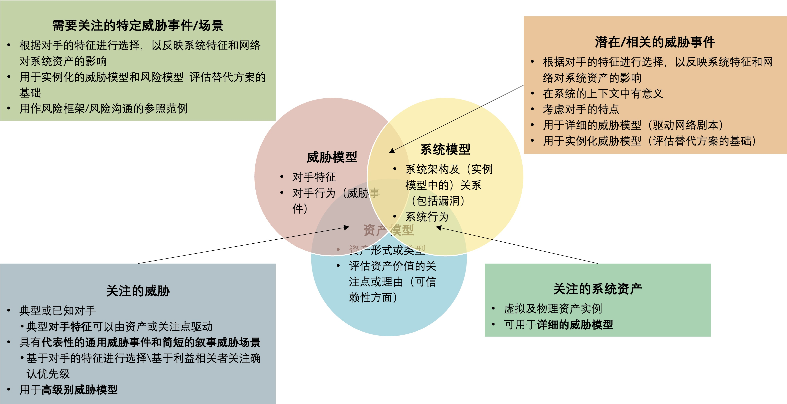

# 4 分析与评估

&emsp;&emsp;这个章节对第2节和第3节中提出的文献调查结果进行了分析和评估。在4.1节中，为描述目的和比较，使用了结构化的属性集来描述模型和框架的特征，明确了通用模型和网络威胁建模领域模型的属性，并依据这些属性对第2节和第3节所描述的威胁模型和框架进行描述。 

&emsp;&emsp;4.2节描述了具有不同属性的模型和框架如何相互关联，以及如何组合起来以更全面地表示和共享有关威胁环境的信息。在第4.3节中，对模型和框架进行了评估以供NGCI Apex计划使用。尽管此评估特定针对NGCI Apex，但评估标准和摘要评估可以在更广泛的范围内使用。 

## 4.1 威胁模型特征化

&emsp;&emsp;以更有条理的方式对威胁框架和模型进行描述会帮助理清其作用和范围。一般而言，在描述模型（尤其是威胁模型）时，可以考虑从多种维度来描述。第4.1.1节回顾了常规模型的特点。第4.1.2节具体考虑了威胁模型的特征，以及如何将其应用于支持NGCI Apex目标。 

&emsp;&emsp;基于这些，确定了与NGCI Apex相关的网络威胁模型的几个关键方面。然后在第4.1.3节中，根据这些关键方面来描述第2节和第3节中描述的模型、框架和方法。 

### 4.1.1 常规模型特征化

&emsp;&emsp;随着金融部门开始依靠模型来支持决策，管理与这些模型相关的风险的必要性已日益成为共识。OCC关于模型风险管理（MRM）的指南——（即与模型相关的风险）——提供了不同模型质量属性的典型示例：精度、准确性、区分能力、稳健性、稳定性和可靠性[OCC2011]，并定义了MRM框架以提供更多架构来理解这些特征。OCC指南和这些框架中确定的因素或维度可用于为网络风险和网络威胁模型的描述和评估提供信息。其描述了两个代表性的MRM框架，以突出可用于评估或描述网络威胁模型的代表性因素或特征。 

&emsp;&emsp;普华永道（PwC）定义了四类模型：简单因素、复杂的单一方案、受约束的多场景方案和不受约束的特定于企业的模型[PwC 2015]。普华永道明确了可以在这些类别中进行比较的七个属性：准确性（模型反映现实情况的程度）、保守性（在模型中建立稳健性的难易程度）、范围（评估模型时需要考虑多少个值）、缓冲区（为了管理模型风险，必须在模型支持的决策中包含多少缓冲区）、寿命（在模型所代表的领域发生变化的情况下模型可以生存多长时间）、博弈（对模型进行“博弈”以获得特定结果有多容易）和可比性（比较不同企业之间的模型结果有多容易） 。 

&emsp;&emsp;管理解决方案指出了建模风险的三种来源：用可用性和质量描述的数据缺陷、估计的不确定性或模型错误、以及模型滥用[Management Solutions 2014]。管理解决方案明确了可对建模风险分类的三个因素：重要性（模型滥用或错误的后果的严重性）、复杂性、以及对决策的影响（具体包括根据模型确认的决策所要告知的范围–部门、机构或外部）。基于这些因素，可以将模型描述为高、中或低风险。 

&emsp;&emsp;模型风险的视角可以应用于网络风险模型和网络威胁模型。网络风险模型可以让组织、部门、联邦部门或机构能够识别、确定优先级并比较对网络风险的替代性缓释措施的相对有效性。模型风险主要与（1）忽略或未能体现风险类别、（2）低估网络风险类别或（3）高估网络风险类别有关。这些模型风险会导致风险暴露增加或资源分配错误。网络威胁模型让组织、部门或联邦部门或机构能够识别、确认优先级、共享信息并定义网络威胁参与者、事件或场景类别的行动方案。模型风险主要与（1）无法识别威胁类别、（2）错误描述或低估与威胁类别相关的可能性、或（3）高估与风险类别相关的可能性有关。这些模型风险导致无法共享威胁情报（或有效利用威胁情报），并为网络风险模型带来模型风险。 

&emsp;&emsp;在MRM上下文中定义的模型质量属性可体现用于描述和评估网络威胁模型的标准，如4.1.2和4.3.1节所述。例如，精度和准确度可体现规范，可比性体现可伸缩性。 

### 4.1.2 网络威胁模型特征化

&emsp;&emsp;网络威胁模型、框架和方法的十一个特征是在考虑了用于描述模型的一般因素，以及 NGCI Apex 计划的目标和此网络威胁建模调查和评估的作用基础上而制定的。前三个与模型的适用性有关：它们可以在哪些设置中使用？接下来的五个与模型的架构有关：包括什么内容，详细程度如何？最后三个考虑了潜在组织使用模型的注意事项。这些特征在表3中做了定义；其中用于描述所调查框架和模型的值以粗体表示。 

<b>表3.威胁模型和框架的特征</b>

<table>
  <tr>
    <th width=15%>特征</th>
    <th>详述</th>
  </tr>
  <tr>
    <td><b>风险管理的级别或层级</b></td>
    <td>如1.2.1和2.1.1所属，网络安全风险可在<b>国家</b>或跨国层、<b>行业</b>或利益共同体层、<b>组织</b>层（或执行层）、业务职能层（或业务流程级别），及<b>系统</b>层（可称为实施层）进行管理。</td>
  </tr>
  <tr>
    <td><b>对应的部门或业务环境</b> </td>
    <td>一些威胁模型和框架面对<b>特定的关键基础架构部门</b>或业务部门。其他的则与<b>部门无关</b>。还有一些其他的方法旨在<b>面向特定活动</b>或过程的背景下识别威胁并管理风险，例如软件开发。 </td>
  </tr>
  <tr>
    <td><b>技术环境 </b></td>
    <td>一些威胁模型和框架假设了<b>特定的技术环境</b>（例如IT企业、开发中的软件、windows）。其他的则<b>与技术无关</b>。需注意的是，某种程度上，威胁模型包括了网络攻击生命周期的全部或部分，其看起来可能是面向IT企业的。</td>
  </tr>
  <tr>
    <td><b>威胁域覆盖 </b></td>
    <td>此特征具有多个方面，包括所映射的攻击生命周期的部分，以及是否考虑内部威胁、供应链攻击和非网络攻击。一些威胁模型或框架<b>明确</b>定义了网络攻击生命周期的各个阶段。其他则<b>隐含</b>地提及或适用于某些特定阶段；还有一些没有提及网络攻击生命周期模型。虽然可以使用网络攻击生命周期模型来表示内部威胁行为，但也包含一些明确针对<b>内部</b>威胁的模型框架。某些威胁模型侧重于<b>现有的</b>、正在使用的系统（处于O＆M阶段），某些威胁模型侧重于<b>正在开发</b>的系统，而其他威胁模型则侧重于SDLC中的<b>多个阶段</b>。最后，一些威胁模型考虑了<b>供应链</b>攻击，有些则考虑非<b>网络</b>或混合类型的攻击。</td>
  </tr>
  <tr>
    <td><b>定义的关键术语 </b></td>
    <td>如第1节所述，许多与网络威胁有关的术语是通用的。一些威胁模型定义了许多这样的术语，而有些使用的术语没有定义。模型定义或使用的术语隐式或显式决定了其涵盖了多少网络威胁建模域。（请注意，一些调查到的威胁模型和框架是4.2.2节中风险模型的一部分。）</td>
  </tr>
  <tr>
    <td><b>详细程度或粒度 </b></td>
    <td>某些威胁模型或框架仅定义了几个关键术语或属性，强调了知识库的价值而非对分析的支持（详细程度较<b>低</b>）。在实际使用中，此类模型旨在可扩展，并在使用时定义其他术语、概念、关系和算法。其他模型定义了更多的建模架构（一般有典型值支持），但主张可扩展性胜于完整性（<b>中等</b>程度的细节，包括或未包括明确对可扩展性的支持）。这样的模型强调寿命和健壮性。还有一些模型定义了许多术语和值，将它们组织在多层分类法或本体中，强调精确性、准确性和却别性（详细程度<b>高</b>，通常不可扩展）。对于某些框架或建模方法，详细程度取决于如何使用框架或方法。其详细程度或粒度用D做标识符号。</td>
  </tr>
  <tr>
    <td><b>复杂度 </b></td>
    <td>一些威胁模型或框架以笼统的术语（<b>低</b>复杂度）表示关键术语和概念之间的关系。其他的模型（通常是那些具有中到高级的细节）定义或描述了关键术语和概念之间的依赖关系和功能关系，并提供了通常以表格形式（<b>中等</b>复杂度）组合值的通用算法。还有一些（通常是那些详细程度很<b>高</b>的）定义了许多依赖关系和功能关系，并在其中指定了（高复杂度）计算算法细节。使用高度复杂的模型通常依赖于建模和方针（M&S）工具。</td>
  </tr>
  <tr>
    <td><b>严格度 </b></td>
    <td>模型的严格性或合理性取决于诸如以下各项的因素：模型的术语定义的如何好、模型中的术语之间的关系被描述的多么清晰和完整、模型所使用的计算算法及可能的值被描述的多么完全。可以使用三个值来描述模型特征：<b>低</b>（模糊且不完整；主要用于说明目的）、<b>中等</b>（已定义且部分详细描述；旨在进行定性分析）、和<b>高</b>（定义明确，详细描述的，且在主题专家视角是完全与其解决的领域相关；用于定量分析）。【见引用1】</td>
  </tr>
  <tr>
    <td><b>填充度 </b></td>
    <td>威胁模型框架是可以<b>不被填充的</b>，即定义了关键术语，但未给出代表值。大多数威胁建模框架都填充了具有<b>代表性的</b>属性值或具有代表性的示例。一些威胁建模框架<b>大量</b>填充了值，因此模型用户仅需要选择值。 </td>
  </tr>
  <tr>
    <td><b>采纳度 </b></td>
    <td >一些威胁模型，框架或建模方法填补了一个<b>细分空白</b>，并且仅被小型用户群采用。有些用作<b>参考</b>观点。其他的则被<b>广泛使用</b>，并且具备专业知识的分析师提供的“安装基础”，以及已发布的工作示例或者经验。 </td></tr>
  <tr>
    <td><b>与其他框架或标准的兼容性 </b></td>
    <td>某些威胁模型与STIX和NIST SP 800-30提供的事实上标准<b>高度</b>兼容，使用相同的术语和关系，同时补充了更多详细信息。其他的则是<b>中等</b>兼容的：其可以与一个或多个事实上的标准一起使用，但也可以独立使用。还有一些具备<b>低</b>兼容性：其被设计为独立使用。 </td>
  </tr>
</table>

>  注：引用1

严格程度也可以是使用模型的过程或方法的属性，例如威胁建模、风险评估或红队评估。当应用于流程时，严格性（以及详细程度）是分析或评估深度的关键属性。在NIST SP 800-53A [NIST 2014b]中，为分析深度提供的代表值是基本的、集中的和全面的。

&emsp;&emsp;也可以定义第十二个特征：对分析师素质的依赖。其决定了使用某个威胁模型能可靠再现结果的程度。通常，对分析师素质的依赖程度由严谨性、复杂性和模型填充性等因素决定，并且与赋值中固有的不确定性有关。考虑到对手的TTP和目标随时间变化的因素，不确定性是网络威胁领域固有的。所有考察的模型都高度依赖分析人员的素质。

### 4.1.3 网络威胁框架、方法论和通用模型

&emsp;&emsp;表4总结了这些特征如何应用于第2节和第3节中调查的威胁框架和模型。可以立即看到：除了DSB 6层威胁层次结构和DACS，所有调查的威胁模型都不打算用于一个单一的组织。威胁被假定是针对的是组织、资产、业务职能或功能，而不是行业。一些模型适配了对任务或业务功能的威胁的描述，从概念上讲可以超越或扩展至组织。但是，在行业级别应用此类模型仍需要进行定制和扩展。 

<b>表4. 调查的威胁模型和框架概况</b>

<table style="width: 100%" border="1" cellspacing="0" align="center">
    <tr style="background-color:lightblue;">
      <th width=15%>框架或模型</th>
      <th colspan="3">特征</th>
    </tr>
    <tr>
      <td rowspan="12"><b>NIST SP 800-30R1</b></td>
      <td width=10%>可能使用场景</td>
      <td colspan="2">风险评估</td>      
    </tr>
    <tr>
      <td rowspan="3">适用性</td>
      <td width=12%>范围</td>
      <td>组织、业务职能、系统</td>
    </tr>
    <tr>
      <td>商业环境</td>
      <td>不相关，但根据联合转型计划为联邦组织创建</td>
    </tr>
    <tr>
      <td>技术环境</td>
      <td>不相关</td>
    </tr>
    <tr>
      <td rowspan="5">结构</td>
      <td>威胁域覆盖范围</td>
      <td>网络攻击生命周期中七个阶段的威胁事件的典型事例。 确定需要关注的内部威胁、供应链攻击、非网络攻击。 适用于多个SDLC阶段。</td>
    </tr>
    <tr>
      <td>详细程度</td>
      <td>中等；可扩展的。明确容纳工技术作为附加的详细信息级别。</td>
    </tr>
    <tr>
      <td>关键术语</td>
      <td>威胁源；对手能力；意图和针对性；威胁事件；威胁场景和网络战役</td>
    </tr>
    <tr>
      <td>复杂度</td>
      <td>中等</td>
    </tr>
    <tr>
      <td>严格度</td>
      <td>中等</td>
    </tr>
    <tr>
      <td rowspan="3">使用注意事项</td>
      <td >填充度 </td>
      <td >代表性的属性值 </td>
    </tr>
    <tr>
      <td>采纳度</td>
      <td>高（英国金融业）</td>
    </tr>
    <tr>
        <td>兼容性</td>
        <td>高（NIST SP 800-30，50多个来源的参考列表）</td>
      </tr>
      <tr>
        <td rowspan="12"><b>CBEST</b></td>
        <td>可能使用场景</td>
        <td colspan="2">渗透测试</td>      
      </tr>
      <tr>
        <td rowspan="3">适用性</td>
        <td>范围</td>
        <td>组织、业务职能、系统</td>
      </tr>
      <tr>
        <td>商业环境</td>
        <td>不相关，但为英国金融业创建</td>
      </tr>
      <tr>
        <td>技术环境</td>
        <td>不相关</td>
      </tr>
      <tr>
        <td rowspan="5">结构</td>
        <td>威胁域覆盖范围</td>
        <td>定义了网络攻击生命周期的六个阶段。 识别内部威胁、供应链攻击。 适用于多个SDLC阶段。</td>
      </tr>
      <tr>
        <td>详细程度</td>
        <td>高</td>
      </tr>
      <tr>
        <td>关键术语</td>
        <td>威胁实体的目标定位（包括身份、动机和意图）、能力和作案手法</td>
      </tr>
      <tr>
        <td>复杂度</td>
        <td>中等</td>
      </tr>
      <tr>
        <td>严格度</td>
        <td>中等</td>
      </tr>
      <tr>
        <td rowspan="3">使用注意事项</td>
        <td >填充度</td>
        <td >代表值</td>
      </tr>
      <tr>
        <td>采纳度</td>
        <td>高（英国金融业）</td>
      </tr>
      <tr>
          <td>兼容性</td>
          <td>高（NIST SP 800-30，50多个来源的参考列表）</td>
        </tr>
    <tr>
      <td rowspan="12"><b>COBIT及Risk IT</b></td>
      <td>可能使用场景</td>
      <td colspan="2">风险评估</td>      
    </tr>
    <tr>
      <td rowspan="3">适用性</td>
      <td>范围</td>
      <td>组织、业务职能、系统</td>
    </tr>
    <tr>
      <td>商业环境</td>
      <td>不相关</td>
    </tr>
    <tr>
      <td>技术环境</td>
      <td>不相关</td>
    </tr>
    <tr>
      <td rowspan="5">结构</td>
      <td>威胁域覆盖范围</td>
      <td>没有提及网络攻击的生命周期。 Risk IT流程可用于分析SDLC中的内部威胁、供应链攻击和非网络攻击。</td>
    </tr>
    <tr>
      <td>详细程度</td>
      <td>低</td>
    </tr>
    <tr>
      <td>关键术语</td>
      <td>威胁参与者、威胁目标、威胁向量、受影响的资产或资源、时间、风险场景</td>
    </tr>
    <tr>
      <td>复杂度</td>
      <td>低</td>
    </tr>
    <tr>
      <td>严格度</td>
      <td>低</td>
    </tr>
    <tr>
      <td rowspan="3">使用注意事项</td>
      <td >填充度 </td>
      <td >公开出版物中少量的案例；商业报告中的60种代表性场景</td>
    </tr>
    <tr>
      <td>采纳度</td>
      <td>中等</td>
    </tr>
    <tr>
        <td>兼容性</td>
        <td>中等（NIST SP 800-30）</td>
      </tr>
      <tr>
        <td rowspan="12"><b>COBIT及Risk IT</b></td>
        <td>可能使用场景</td>
        <td colspan="2">风险评估</td>      
      </tr>
      <tr>
        <td rowspan="3">适用性</td>
        <td>范围</td>
        <td>组织、业务职能、系统</td>
      </tr>
      <tr>
        <td>商业环境</td>
        <td>不相关</td>
      </tr>
      <tr>
        <td>技术环境</td>
        <td>不相关</td>
      </tr>
      <tr>
        <td rowspan="5">结构</td>
        <td>威胁域覆盖范围</td>
        <td>没有提及网络攻击的生命周期。 Risk IT流程可用于分析SDLC中的内部威胁、供应链攻击和非网络攻击。</td>
      </tr>
      <tr>
        <td>详细程度</td>
        <td>低</td>
      </tr>
      <tr>
        <td>关键术语</td>
        <td>威胁参与者、威胁目标、威胁向量、受影响的资产或资源、时间、风险场景</td>
      </tr>
      <tr>
        <td>复杂度</td>
        <td>低</td>
      </tr>
      <tr>
        <td>严格度</td>
        <td>低</td>
      </tr>
      <tr>
        <td rowspan="3">使用注意事项</td>
        <td >填充度 </td>
        <td >公开出版物中少量的案例；商业报告中的60种代表性场景</td>
      </tr>
      <tr>
        <td>采纳度</td>
        <td>中等</td>
      </tr>
      <tr>
          <td>兼容性</td>
          <td>中等（NIST SP 800-30）</td>
        </tr>
    <tr>
      <td rowspan="12"><b>DSB六层威胁等级</b></td>
      <td>可能使用场景</td>
      <td colspan="2">风险框架</td>      
    </tr>
    <tr>
      <td rowspan="3">适用性</td>
      <td>范围</td>
      <td>行业、组织、业务职能、系统</td>
    </tr>
    <tr>
      <td>商业环境</td>
      <td>军事的</td>
    </tr>
    <tr>
      <td>技术环境</td>
      <td>不相关</td>
    </tr>
    <tr>
      <td rowspan="5">结构</td>
      <td>威胁域覆盖范围</td>
      <td>没不适用网络攻击生命周期。较高层级考虑内部威胁和供应链威胁。</td>
    </tr>
    <tr>
      <td>详细程度</td>
      <td>低</td>
    </tr>
    <tr>
      <td>关键术语</td>
      <td>网络威胁、威胁参与者、复杂程度、运营规模、时间表</td>
    </tr>
    <tr>
      <td>复杂度</td>
      <td>低</td>
    </tr>
    <tr>
      <td>严格度</td>
      <td>低</td>
    </tr>
    <tr>
      <td rowspan="3">使用注意事项</td>
      <td >填充度 </td>
      <td >低</td>
    </tr>
    <tr>
      <td>采纳度</td>
      <td>中等（经常被引用，不仅仅用于军事）</td>
    </tr>
    <tr>
        <td>兼容性</td>
        <td>高（NIST SP 800-30）</td>
      </tr>
    <tr>
      <td rowspan="12"><b>Cyber Prep（CP）及DACS</b></td>
      <td>可能使用场景</td>
      <td colspan="2">风险框架</td>      
    </tr>
    <tr>
      <td rowspan="3">适用性</td>
      <td>范围</td>
      <td>组织（DACS的所有范围）</td>
    </tr>
    <tr>
      <td>商业环境</td>
      <td>不相关</td>
    </tr>
    <tr>
      <td>技术环境</td>
      <td>不相关</td>
    </tr>
    <tr>
      <td rowspan="5">结构</td>
      <td>威胁域覆盖范围</td>
      <td>适用网络攻击生命周期阶段来描述对手。不适用内部威胁或供应链攻击生命周期。
        </td>
    </tr>
    <tr>
      <td>详细程度</td>
      <td>低</td>
    </tr>
    <tr>
      <td>关键术语</td>
      <td>业务目标、业务范围或规模、业务时间表、持久性、隐匿性、适用的网络攻击生命周期的阶段、寻求或产生的网络影响及能力</td>
    </tr>
    <tr>
      <td>复杂度</td>
      <td>低</td>
    </tr>
    <tr>
      <td>严格度</td>
      <td>低</td>
    </tr>
    <tr>
      <td rowspan="3">使用注意事项</td>
      <td >填充度 </td>
      <td >对手特征的代表值或量表</td>
    </tr>
    <tr>
      <td>采纳度</td>
      <td>低</td>
    </tr>
    <tr>
        <td>兼容性</td>
        <td>高（NIST SP 800-30）</td>
      </tr>
    <tr>
      <td rowspan="12"><b>NIST SP 800-154（草案）</b></td>
      <td>可能使用场景</td>
      <td colspan="2">设计分析</td>      
    </tr>
    <tr>
      <td rowspan="3">适用性</td>
      <td>范围</td>
      <td>系统</td>
    </tr>
    <tr>
      <td>商业环境</td>
      <td>不相关</td>
    </tr>
    <tr>
      <td>技术环境</td>
      <td>不相关</td>
    </tr>
    <tr>
      <td rowspan="5">结构</td>
      <td>威胁域覆盖范围</td>
      <td>适未讨论网络攻击生命周期。</td>
    </tr>
    <tr>
      <td>详细程度</td>
      <td>中等；可扩展</td>
    </tr>
    <tr>
      <td>关键术语</td>
      <td>威胁、攻击向量</td>
    </tr>
    <tr>
      <td>复杂度</td>
      <td>中等</td>
    </tr>
    <tr>
      <td>严格度</td>
      <td>中等</td>
    </tr>
    <tr>
      <td rowspan="3">使用注意事项</td>
      <td >填充度 </td>
      <td >代表值</td>
    </tr>
    <tr>
      <td>采纳度</td>
      <td>低（草案）</td>
    </tr>
    <tr>
        <td>兼容性</td>
        <td>中等（NIST SP 800-30）</td>
      </tr>
    <tr>
      <td rowspan="12"><b>DREAD</b></td>
      <td>可能使用场景</td>
      <td colspan="2">设计分析</td>      
    </tr>
    <tr>
      <td rowspan="3">适用性</td>
      <td>范围</td>
      <td>系统</td>
    </tr>
    <tr>
      <td>商业环境</td>
      <td>不相关，但为软件开发而创建</td>
    </tr>
    <tr>
      <td>技术环境</td>
      <td>软件</td>
    </tr>
    <tr>
      <td rowspan="5">结构</td>
      <td>威胁域覆盖范围</td>
      <td>通过合并STRIDE隐式使用网络攻击生命周期。不解决内部威胁、供应链攻击及非网络问题。</td>
    </tr>
    <tr>
      <td>详细程度</td>
      <td>低</td>
    </tr>
    <tr>
      <td>关键术语</td>
      <td>[不是威胁模型；威胁利用的风险评估方法] 威胁利用</td>
    </tr>
    <tr>
      <td>复杂度</td>
      <td>低</td>
    </tr>
    <tr>
      <td>严格度</td>
      <td>低</td>
    </tr>
    <tr>
      <td rowspan="3">使用注意事项</td>
      <td >填充度 </td>
      <td >代表值</td>
    </tr>
    <tr>
      <td>采纳度</td>
      <td>低</td>
    </tr>
    <tr>
        <td>兼容性</td>
        <td>中等</td>
      </tr>
    <tr>
      <td rowspan="12"><b>OCTAVE/Allegro</b></td>
      <td>可能使用场景</td>
      <td colspan="2">风险评估</td>      
    </tr>
    <tr>
      <td rowspan="3">适用性</td>
      <td>范围</td>
      <td>组织、业务职能、系统</td>
    </tr>
    <tr>
      <td>商业环境</td>
      <td>不相关</td>
    </tr>
    <tr>
      <td>技术环境</td>
      <td>不相关</td>
    </tr>
    <tr>
      <td rowspan="5">结构</td>
      <td>威胁域覆盖范围</td>
      <td>不使用网络攻击生命周期。流程可用于分析内部威胁、供应链攻击和非网络威胁。</td>
    </tr>
    <tr>
      <td>详细程度</td>
      <td>中等；可扩展</td>
    </tr>
    <tr>
      <td>关键术语</td>
      <td>威胁场景、威胁树、方法、结果（网络效应）</td>
    </tr>
    <tr>
      <td>复杂度</td>
      <td>中等</td>
    </tr>
    <tr>
      <td>严格度</td>
      <td>中等</td>
    </tr>
    <tr>
      <td rowspan="3">使用注意事项</td>
      <td >填充度 </td>
      <td >代表值； 四类威胁（威胁树的顶层节点）
        </td>
    </tr>
    <tr>
      <td>采纳度</td>
      <td>中等</td>
    </tr>
    <tr>
        <td>兼容性</td>
        <td>低</td>
    </tr>
    <tr>
      <td rowspan="12"><b>Inter’s TARA and TAL</b></td>
      <td>可能使用场景</td>
      <td colspan="2">风险评估（TARA）、风险框架（TAL）</td>      
    </tr>
    <tr>
      <td rowspan="3">适用性</td>
      <td>范围</td>
      <td>组织、业务职能、系统</td>
    </tr>
    <tr>
      <td>商业环境</td>
      <td>不相关</td>
    </tr>
    <tr>
      <td>技术环境</td>
      <td>不相关</td>
    </tr>
    <tr>
      <td rowspan="5">结构</td>
      <td>威胁域覆盖范围</td>
      <td>没有提及网络攻击的生命周期。流程可用于分析内部威胁、供应链攻击和非网络威胁。</td>
    </tr>
    <tr>
      <td>详细程度</td>
      <td>低</td>
    </tr>
    <tr>
      <td>关键术语</td>
      <td>威胁因素、动机、目标（网络效应）、资源（人员）、技能、方法、攻击、可见性（隐匿性）</td>
    </tr>
    <tr>
      <td>复杂度</td>
      <td>中等</td>
    </tr>
    <tr>
      <td>严格度</td>
      <td>中等</td>
    </tr>
    <tr>
      <td rowspan="3">使用注意事项</td>
      <td >填充度 </td>
      <td >代表值； 八个属性，22种威胁原型</td>
    </tr>
    <tr>
      <td>采纳度</td>
      <td>低（但已纳入OWASP）</td>
    </tr>
    <tr>
        <td>兼容性</td>
        <td>高（NIST SP 800-30，ATT&CK，OWASP）</td>
    </tr>
    <tr>
      <td rowspan="12"><b>IDDIL/ATC</b></td>
      <td>可能使用场景</td>
      <td colspan="2">风险评估</td>      
    </tr>
    <tr>
      <td rowspan="3">适用性</td>
      <td>范围</td>
      <td>系统</td>
    </tr>
    <tr>
      <td>商业环境</td>
      <td>不相关</td>
    </tr>
    <tr>
      <td>技术环境</td>
      <td>不相关</td>
    </tr>
    <tr>
      <td rowspan="5">结构</td>
      <td>威胁域覆盖范围</td>
      <td>使用洛克希德·马丁网络杀伤链。</td>
    </tr>
    <tr>
      <td>详细程度</td>
      <td>中等；可扩展</td>
    </tr>
    <tr>
      <td>关键术语</td>
      <td>资产、威胁参与者、攻击向量、威胁概况、威胁类型、攻击面</td>
    </tr>
    <tr>
      <td>复杂度</td>
      <td>中等</td>
    </tr>
    <tr>
      <td>严格度</td>
      <td>中等</td>
    </tr>
    <tr>
      <td rowspan="3">使用注意事项</td>
      <td >填充度 </td>
      <td >公开发表物中的代表值</td>
    </tr>
    <tr>
      <td>采纳度</td>
      <td>低</td>
    </tr>
    <tr>
        <td>兼容性</td>
        <td>高（NIST SP 800-30，STRIDE）</td>
    </tr>
    <tr>
      <td rowspan="12"><b>STIX</b></td>
      <td>可能使用场景</td>
      <td colspan="2">威胁信息共享</td>      
    </tr>
    <tr>
      <td rowspan="3">适用性</td>
      <td>范围</td>
      <td>组织、业务职能、系统</td>
    </tr>
    <tr>
      <td>商业环境</td>
      <td>不相关</td>
    </tr>
    <tr>
      <td>技术环境</td>
      <td>不相关</td>
    </tr>
    <tr>
      <td rowspan="5">结构</td>
      <td>威胁域覆盖范围</td>
      <td>定义了网络攻击生命周期的七个阶段。包括内部威胁；不涉及供应链攻击或非网络攻击。</td>
    </tr>
    <tr>
      <td>详细程度</td>
      <td>中等</td>
    </tr>
    <tr>
      <td>关键术语</td>
      <td>威胁攻击者（目标、复杂程度、资源水平、主要动机、次要动机和个人动机）；恶意软件；工具；攻击方式；战役；入侵工具集</td>
    </tr>
    <tr>
      <td>复杂度</td>
      <td>中等</td>
    </tr>
    <tr>
      <td>严格度</td>
      <td>中等</td>
    </tr>
    <tr>
      <td rowspan="3">使用注意事项</td>
      <td >填充度 </td>
      <td >取决于社区组织用户</td>
    </tr>
    <tr>
      <td>采纳度</td>
      <td>高</td>
    </tr>
    <tr>
        <td>兼容性</td>
        <td>高（事实上的标准）</td>
    </tr>
    <tr>
      <td rowspan="12"><b>OMG Threat/Risk Model</b></td>
      <td>可能使用场景</td>
      <td colspan="2">威胁信息共享</td>      
    </tr>
    <tr>
      <td rowspan="3">适用性</td>
      <td>范围</td>
      <td>组织、业务职能、系统</td>
    </tr>
    <tr>
      <td>商业环境</td>
      <td>不相关</td>
    </tr>
    <tr>
      <td>技术环境</td>
      <td>不相关</td>
    </tr>
    <tr>
      <td rowspan="5">结构</td>
      <td>威胁域覆盖范围</td>
      <td>提供一种结构，可以在其中定义各种对手和攻击。</td>
    </tr>
    <tr>
      <td>详细程度</td>
      <td>高</td>
    </tr>
    <tr>
      <td>关键术语</td>
      <td>操作风险、威胁、威胁源、威胁参与者、意外事件、战术、技术、过程、攻击目标、目标、战役</td>
    </tr>
    <tr>
      <td>复杂度</td>
      <td>高</td>
    </tr>
    <tr>
      <td>严格度</td>
      <td>中等</td>
    </tr>
    <tr>
      <td rowspan="3">使用注意事项</td>
      <td >填充度 </td>
      <td >取决于社区组织用户</td>
    </tr>
    <tr>
      <td>采纳度</td>
      <td>待确认（希望为高，努力中）</td>
    </tr>
    <tr>
        <td>兼容性</td>
        <td>高（STIX）</td>
    </tr>
    <tr>
      <td rowspan="12"><b>ATT&CK</b></td>
      <td>可能使用场景</td>
      <td colspan="2">威胁信息共享</td>      
    </tr>
    <tr>
      <td rowspan="3">适用性</td>
      <td>范围</td>
      <td>系统</td>
    </tr>
    <tr>
      <td>商业环境</td>
      <td>不相关</td>
    </tr>
    <tr>
      <td>技术环境</td>
      <td>windows</td>
    </tr>
    <tr>
      <td rowspan="5">结构</td>
      <td>威胁域覆盖范围</td>
      <td>适用于漏洞利用的网络攻击生命周期。不解决内部威胁、供应链攻击及非网络问题。</td>
    </tr>
    <tr>
      <td>详细程度</td>
      <td>高</td>
    </tr>
    <tr>
      <td>关键术语</td>
      <td>对手TTP</td>
    </tr>
    <tr>
      <td>复杂度</td>
      <td>低</td>
    </tr>
    <tr>
      <td>严格度</td>
      <td>中等</td>
    </tr>
    <tr>
      <td rowspan="3">使用注意事项</td>
      <td >填充度 </td>
      <td >目前有230个条目；可扩展</td>
    </tr>
    <tr>
      <td>采纳度</td>
      <td>中等</td>
    </tr>
    <tr>
        <td>兼容性</td>
        <td>高（STIX）</td>
    </tr>
    <tr>
        <td rowspan="12"><b>CAPECTM</b></td>
        <td>可能使用场景</td>
        <td colspan="2">威胁信息共享</td>      
      </tr>
      <tr>
        <td rowspan="3">适用性</td>
        <td>范围</td>
        <td>系统</td>
      </tr>
      <tr>
        <td>商业环境</td>
        <td>不相关</td>
      </tr>
      <tr>
        <td>技术环境</td>
        <td>不相关；强调Windows及*nix</td>
      </tr>
      <tr>
        <td rowspan="5">结构</td>
        <td>威胁域覆盖范围</td>
        <td>定义了三个阶段：“探索”、“实验”或“利用”。部分条目代表内部威胁、供应链攻击和非网络攻击。</td>
      </tr>
      <tr>
        <td>详细程度</td>
        <td>高</td>
      </tr>
      <tr>
        <td>关键术语</td>
        <td>攻击模式、攻击机制、攻击范围</td>
      </tr>
      <tr>
        <td>复杂度</td>
        <td>中等</td>
      </tr>
      <tr>
        <td>严格度</td>
        <td>中等</td>
      </tr>
      <tr>
        <td rowspan="3">使用注意事项</td>
        <td >填充度 </td>
        <td >第2.11版中的508条</td>
      </tr>
      <tr>
        <td>采纳度</td>
        <td>高</td>
      </tr>
      <tr>
          <td>兼容性</td>
          <td>中等（NIST SP 800-30）</td>
      </tr>
    <tr>
      <td rowspan="12"><b>OWASP</b></td>
      <td>可能使用场景</td>
      <td colspan="2">设计分析</td>      
    </tr>
    <tr>
      <td rowspan="3">适用性</td>
      <td>范围</td>
      <td>系统</td>
    </tr>
    <tr>
      <td>商业环境</td>
      <td>不相关</td>
    </tr>
    <tr>
      <td>技术环境</td>
      <td>不相关；强调Windows及*nix</td>
    </tr>
    <tr>
      <td rowspan="5">结构</td>
      <td>威胁域覆盖范围</td>
      <td>不使用网络攻击生命周期、内部威胁或供应链攻击。</td>
    </tr>
    <tr>
      <td>详细程度</td>
      <td>中等</td>
    </tr>
    <tr>
      <td>关键术语</td>
      <td>威胁事件；威胁分类</td>
    </tr>
    <tr>
      <td>复杂度</td>
      <td>低</td>
    </tr>
    <tr>
      <td>严格度</td>
      <td>低</td>
    </tr>
    <tr>
      <td rowspan="3">使用注意事项</td>
      <td >填充度 </td>
      <td >OWASP中的20个威胁事件手册</td>
    </tr>
    <tr>
      <td>采纳度</td>
      <td>中等（OWASP社区）</td>
    </tr>
    <tr>
        <td>兼容性</td>
        <td>中等（NIST SP 800-30）</td>
    </tr>
    <tr>
      <td rowspan="12"><b>网络威胁框架（ODNI，NSA/CSS）</b></td>
      <td>可能使用场景</td>
      <td colspan="2">威胁信息共享</td>      
    </tr>
    <tr>
      <td rowspan="3">适用性</td>
      <td>范围</td>
      <td>系统、业务职能、组织</td>
    </tr>
    <tr>
      <td>商业环境</td>
      <td>不相关</td>
    </tr>
    <tr>
      <td>技术环境</td>
      <td>不相关</td>
    </tr>
    <tr>
      <td rowspan="5">结构</td>
      <td>威胁域覆盖范围</td>
      <td>使用网络攻击生命周期。不解决内部威胁。</td>
    </tr>
    <tr>
      <td>详细程度</td>
      <td>中等；可扩展</td>
    </tr>
    <tr>
      <td>关键术语</td>
      <td>威胁参与者、攻击阶段、行动目标、行动、指标</td>
    </tr>
    <tr>
      <td>复杂度</td>
      <td>中等</td>
    </tr>
    <tr>
      <td>严格度</td>
      <td>中等</td>
    </tr>
    <tr>
      <td rowspan="3">使用注意事项</td>
      <td >填充度 </td>
      <td >NSA/CSS CTF超过200个威胁事件</td>
    </tr>
    <tr>
      <td>采纳度</td>
      <td>中等（在情报社区中被采用）</td>
    </tr>
    <tr>
        <td>兼容性</td>
        <td>中等（用于ODNI的STIX，NSA/CSS的ATT&CK）</td>
    </tr>
    <tr>
      <td rowspan="12"><b>Invincea</b></td>
      <td>可能使用场景</td>
      <td colspan="2">设计分析</td>      
    </tr>
    <tr>
      <td rowspan="3">适用性</td>
      <td>范围</td>
      <td>组织</td>
    </tr>
    <tr>
      <td>商业环境</td>
      <td>不相关</td>
    </tr>
    <tr>
      <td>技术环境</td>
      <td>不相关</td>
    </tr>
    <tr>
      <td rowspan="5">结构</td>
      <td>威胁域覆盖范围</td>
      <td>定义网络攻击生命周期的八个阶段。不涉及供应链或非网络攻击；将内部威胁视为活动工具（攻击向量）。</td>
    </tr>
    <tr>
      <td>详细程度</td>
      <td>低</td>
    </tr>
    <tr>
      <td>关键术语</td>
      <td>对手类型、战役目标、战役车辆、战役武器、有效载荷交付、有效载荷能力</td>
    </tr>
    <tr>
      <td>复杂度</td>
      <td>中等</td>
    </tr>
    <tr>
      <td>严格度</td>
      <td>中等</td>
    </tr>
    <tr>
      <td rowspan="3">使用注意事项</td>
      <td >填充度 </td>
      <td >每个术语的值数量很少。</td>
    </tr>
    <tr>
      <td>采纳度</td>
      <td>低</td>
    </tr>
    <tr>
        <td>兼容性</td>
        <td>中等</td>
    </tr>
  </table>

## 4.2 网络威胁模型评估

&emsp;&emsp;第2节和第3节中调查的许多网络威胁模型可以作为NGCI Apex计划可以使用的可信威胁模型的起点。每种模型都有优点和缺点，并且它们与金融服务部门（或其他关键基础设施部门）的相关性各不相同。在本节中，定义了NGCI Apex采用或定制网络威胁模型的评估标准；并根据这些标准对调查的威胁模型进行了评估。 

### 4.2.1 评估标准

&emsp;&emsp;图13展示了可用于描述模型并评估其对给定用途的适用性的三个广义维度： 

- 规范性：在分类、关系和算法方面，模型的说明有多完整？这决定了其可重复使用和可再现的程度。此维度与诸如细节或粒度级别、复杂性和严格性等特征相关。

- 覆盖范围：该模型涵盖了什么？这确定了什么情况下可以有意义地使用该模型。覆盖范围包括完整性：模型如何完全覆盖其表示的域？例如，威胁模型代表网络攻击生命周期、内部威胁、供应链攻击还是非网络攻击？此外，覆盖范围还包括适用性：模型是否假定特定范围，如业务环境、技术环境或威胁环境？请注意，完整性与当前的知识状态有关，适用性与当前的实践和技术有关。 因此，随着时间的推移，当前全面的模型可以代表所选定的子域。

- 具体性： 模型有多具体？这关系到它的填充程度。

&emsp;&emsp;对于网络威胁模型，采用和可扩展性与规范性有关。可扩展性涉及覆盖范围的某个方面。 

<b>图13.描述一种用于评估有效性的模型</b>

&emsp;&emsp;如第1节所述，威胁模型（包括框架和方法）对NGCI Apex的重要性来自以下三个方面： 

- 威胁模型可用作风险建模过程（尤其是风险度量的定义、评估和共享）的输入。

- 威胁模型可以激发并用于网络战争场景的开发。

- 威胁模型可用于帮助识别和评估网络防御技术，通过帮助指出哪些技术是相关的，并提出可评估其有效性的测试案例和方案。

&emsp;&emsp;如图2所示，可以考虑将这些可能的用途用于不同的范围。如表4所示的已发布模型的调查所示，目前还没有一种被广泛接受的模型能解决所有可能的范围。 

&emsp;&emsp;在接下来的小节中明确了与这些可能用途相关的评估标准。必须指出的是，没有一个单一的模型可以满足所有标准，尤其是当考虑可评估其有效性或可衡量其风险的不同范围时。即使在单次使用的情况下（例如，对一家大型金融机构的网络防御技术进行评估），也可以权衡使用不同标准。 

#### 4.2.1.1 支持风险指标定义与评估

&emsp;&emsp;如第1节所述，威胁模型是风险模型的组成部分，用于生成风险指标。风险模型和风险指标（以及由此构成的风险模型和风险指标的网络威胁模型和度量）的以下特征与支持NGCI Apex的风险评估、跟踪和优先级目标有关： 

- 适应性和可扩展性：例如，如何轻松的适配模型以表示不断发展的威胁能力？如何轻松扩展模型以包含其他概念、属性、因素或算法？

- 可行性： 在实际环境中使用模型，并/或评估指标的实用性如何？
  - 是否可以获取必要的数据（例如，使用现有产品和流程）？
  - 是否可以在合理的时间段内（即足够快地支持决策）以合理的投入（考虑执行分析的实体的规模）对数据进行分析？
  - 对模型和/或指标集的评估和使用是否适合现有治理？特别是，该模型或度量标准如何较好地支持网络安全风险管理作为企业风险管理（ERM）不可或缺的一部分？
- 可采用性： 模型和/或指标集合的采用容易程度如何？特别是，该模型或度量标准与行业机构当前使用的模型或度量标准之间的一致性如何？
- 可扩展性： 该模型的范围是什么？指标是否可以汇总，汇总或以其他方式组合以产生更广泛的指标（例如，从系统到任务，从系统或任务到组织，从组织到部门或跨部门业务功能）？
- 信息共享：该模型与用于共享有关威胁或风险信息的模型或标准的兼容性如何？

#### 4.2.1.2 为网络兵棋推演作战提供基础

&emsp;&emsp;NGCI Apex确定了各种形式的网络兵棋推演的潜在用途，以识别技术、实践、支持政策和标准方面的差距，并评估在关键基础设施部门（重点是金融服务部门）针对网络安全问题提出的或正在实施的解决方案的相对有效性。网络兵棋推演的形式包括桌面演练（具有不同程度的自动化支持）、红队演习和混合练习。 

&emsp;&emsp;桌面演练，以及在较小程度上的混合练习，范围可以从系统级别到国家或跨国级别。红队演习针对系统、业务职能或组织的一部分。针对特定建模构造的威胁模型所需的详细程度取决于演习的范围。例如，一个演练可能会假设一个单一的目标；或者，随着场景的发展，可以考虑第二或第三目标。 

&emsp;&emsp;威胁模型用于为一项演练或一系列相关演练制定威胁情景。任何战争演练都将限于少数威胁场景。规范的某些方面对于某些形式的网络作战而言不太重要，例如，当战争需要大量自动化支持时，复杂性和严谨性很重要，但可能会让许多桌面练习的参与者分心。网络作战威胁模型中会较少考虑完整性。其覆盖范围取决于演习的目的。 

#### 4.2.1.3 网络防御技术的支持配置文件和评估

&emsp;&emsp;就网络防御矩阵（图4）而言， NGCI Apex寻求针对以下问题提供有根据的答案： 

- 给定技术如何改善组织识别网络资源的能力，包括其网络的一部分或者连接到该网络的资源？（网络识别） 

- 给定的技术如何改善组织保护敏感或关键数据的能力？ （数据保护）

- 给定的技术如何改善组织检测敏感或关键数据的渗透、修改或伪造的能力？（数据检测）

- 在网络层上，给定技术的性能如何改善组织检测对手造成的降级、中断、服务修改或方向错误或数据修改的能力？ （网络检测）

&emsp;&emsp;通过使用代表对手活动的威胁模型（例如，其中包括网络攻击生命周期模型）和用于描述对对手活动的可能造成的影响的术语（例如，如[NIST 2018]中所述），可以使这些问题更加精确。 

&emsp;&emsp;除了为单个组织带来好处之外，NGCI Apex还寻求为以下问题提供有充分依据的答案：如果将给定技术广泛应用于某个行业，那么就以下方面而言，该行业的状况将有多大改善： 

- 关联跨部门机构的攻击信息，以便可以制定和实施多组织的响应？ （请注意，参与多个组织的响应的范围可能从一对伙伴机构到少数受影响的机构，再加上执法部门和US-CERT乃至整个部门的响应。 ）

- 检测新的或新兴的对手TTP？

- 确定最有效的防御者TTP来应对对手的活动？

- 传播有关新的或新兴的对手TTP以及有效的防御者TTP的知识？

- 调整系统和网络以保护网络资源免受预期的新对手TTP攻击？

- 识别能够与部门机构运营的系统和网络连接的能力的新技术或新兴技术？

&emsp;&emsp;关于网络防御技术的有效性可以在多种设定中进行评估，包括抽象或概念模型、modsims（即建模和模拟事件）或仿真环境、网络范围、桌面练习、模拟实验（SIMEX，[MITRE 2009 ]）、操作实验和欺骗环境。每个设定都会实例化一个威胁模型、一个或多个技术环境以及一个或多个操作环境，预计在该模型中会产生预期的有效性 [Bodeau 2013b]，进而展示以系统为中心和以资产为中心的威胁建模的各个方面的视图[NIST 2018b]。当构建评估环境（评估有效性的环境）时，必须在这些特征之间进行权衡选择。例如，可以完全指定并完全填充modsim模型，但是通常会做出一些假设限制，将其覆盖范围限制在有限的或目标的子域内。 

### 4.2.2 评估调查的模型，框架和方法

&emsp;&emsp;上述注意事项适用于所有模型，包括风险模型和威胁模型。对于网络威胁模型，可以参考NGCI Apex试图要回答的问题，以及定义的一系列与现实的受威胁相关的网络威胁攻击测试场景的目标，进而对这些注意事项因素进行调整。在使用图12中所示的框架来表示网络威胁模型时，可以考虑以下更详细的问题： 

- 规范性：网络威胁模型上下文中的规范指的是它定义的术语集，在这些术语之间定义的关系，允许分配给这些术语的定性或定量值，以及基于术语关系的算法（用以基于为较低级术语分配或测量的值来计算较高级术语的值）。定义的术语：网络威胁模型如何充分代表标准或常用威胁模型（例如NIST SP 800-30R1，STIX）中使用的术语？模型是定义这些术语还是仅使用它们？术语集是否可以扩展？关系：模型如何以及如何充分定义模型使用的术语之间的关系（例如，依存关系，子集或超集）？例如，该模型是否定义了分类法或本体论，还是仅以文本讨论的形式表达关系？值：模型是明确定义值范围（例如，定性或标称值列表，定量范围）还是隐式定义（例如，通过将示例锚定在定义或术语讨论中）？如果模型提供了定性值，那么定性值集是否可以扩展？算法：模型是否定义了用于分配值的规则或算法？例如，模型是否包含用于合并定性值的表？如果模型定义了规则或算法，这些规则是否可定制？

- 覆盖范围：网络威胁模型范围内的覆盖范围是指威胁源、威胁情景以及它可以覆盖的或预期覆盖的威胁后果的范围。覆盖范围还指的是可以描述威胁的范围。威胁来源：威胁模型仅涵盖来自外部对手的攻击，还是涵盖内部威胁？它是否将人为错误或结构性故障视为主要威胁来源，是对抗性威胁的促成因素，还是根本不考虑？威胁情景：威胁模型是否将注意力限制在已部署、已使用的系统的威胁敏感因素上，还是其包括整个系统生命周期中的威胁情景？特别是是否包括供应链攻击？威胁模型是否假设特定的技术或运营环境（例如Microsoft与* nix；面向消费者的机构与后端机构）？威胁后果：威胁模型是否可以根据对网络、机构或组织造成的后果或对敌人的好处或成就，来识别威胁事件或威胁情景的后果？范围：威胁模型仅用于系统级别（例如，用于通知系统工程决策），还是可以在更广泛的范围内使用？威胁模型是否可以开发跨组织的威胁方案？威胁模型是假设特定的业务环境或关键基础设施部门，还是可以用于开发跨部门的威胁方案？

- 详实性：在网络威胁模型的上下文中，具体性指的是其上下文（或示例）丰富程度以及它可以如何轻松的支持方案、测试用例或用例的开发。填充情况：就关键术语的代表值而言，模型的上下文（或示例）丰富程度如何？这些值是否已通过实际验证？例如，是否有提供实例的现实案例研究？是固定的还是可扩展的？当前是否依然保持有效？方案开发：使用网络威胁模型构建测试案例和调用示例的难易程度如何？该模型对场景开发的支持程度如何？例如，它是否包括作为起点的攻击场景？

在本节中，将根据上述标准对第2节和第3节中调查的模型、框架和方法进行评估。评估如表6所示，使用表5中的关键字。 

<b>表5.评估属性</b>

<table>
    <tr>
        <th></th>
        <th colspan="3">值</th>
    </tr>
    <tr>
        <th>属性</th>
        <th>L</th>
        <th>M</th>
        <th>H</th>
    </tr>
    <tr>
      <td><b>规范（定义、关系、值、算法）</b></td>
      <td>描述的（例如，口头描述）</td>
      <td>概括的（例如，使用样例值）</td>
      <td>完全详实的（例如，提供了完整的规范集合）</td>
    </tr>
    <tr>
        <td>覆盖范围（范围、威胁源、威胁场景、威胁结果）[注：标注“+”表示威胁模型包含非对抗的威胁；标注“*”表示的覆盖率特定于FSS]</td>
        <td>定向的（例如，专注于有特定范围的特定子域）</td>
        <td>广泛的（例如，涵盖多个子域，以及/或多个范围）</td>
        <td>全面的（例如，涵盖某个指定范围的全部子域，以及/或涵盖多个范围的多个子域）</td>
    </tr>
    <tr>
        <td>详实性</td>
        <td>摘要的或者抽象的（例如，很少给出示例）</td>
        <td>代表性的（例如，对于每个模型架构至少提供一个示例）</td>
        <td>良好的或完整的示例（例如，对于每个模型均提供多个示例或值）</td>
    </tr>
    <tr>
        <td>适应性和可扩展性</td>
        <td>静态的或固定的</td>
        <td>可修改或可定制</td>
        <td>高度灵活</td>
    </tr>
    <tr>
        <td>操作环境中的可行性</td>
        <td>不可行（例如，数据必须由SMEs提供）</td>
        <td>部分工具可支持（例如，有限的自动化工具可支持数据收集）</td>
        <td>可由工具及信息共享机制支持</td>
    </tr>
    <tr>
        <td>可采纳性</td>
        <td>与正在使用的模型不一致</td>
        <td>与正在使用的模型一致</td>
        <td>作为正在使用的模型的参考标准</td>
    </tr>
    <tr>
        <td>可测量性</td>
        <td>聚合仅限于频率计数</td>
        <td>有限的汇总指标计算</td>
        <td>旨在实现多个聚合指标</td>
    </tr>
    <tr>
        <td>信息共享（标准兼容性）</td>
        <td>独立的且可能与标准不符</td>
        <td>与一个或多个标准兼容</td>
        <td>构成标准</td>
    </tr>
  </table>

<b>表6.威胁模型与框架的摘要评估</b>

<table>
    <tr>
        <th rowspan="2">框架、方法论或模型</th>
        <th colspan="4">规范性</th>
        <th colspan="4">覆盖范围</th>
        <th colspan="2">详实性</th>
        <th rowspan="2">适应性和可扩展性</th>
        <th rowspan="2">操作环境可行性</th>
        <th rowspan="2">可采纳性</th>
        <th rowspan="2">可测量性</th>
        <th rowspan="2">信息共享（标准兼容性）</th>
    </tr>
    <tr>
        <th>定义</th>
        <th>关系</th>
        <th>值</th>
        <th>算法</th>
        <th>范围</th>
        <th>威胁源</th>
        <th>威胁场景</th>
        <th>威胁结果</th>
        <th>填充情况</th>
        <th>方案开发</th>   
    </tr>
    <tr>
      <td>NIST SP800-30R1</td>
      <td>M</td>
      <td>M</td>
      <td>M</td>
      <td>M</td>
      <td>H+</td>
      <td>H+</td>
      <td>M</td>
      <td>M</td>
      <td>M</td>
      <td>H</td>
      <td>L</td>
      <td>H</td>
      <td>H</td>
      <td>L</td>
    </tr>
    <tr>
      <td>CBEST</td>
      <td>M</td>
      <td>M</td>
      <td>M</td>
      <td>M*</td>
      <td>M*</td>
      <td>M*</td>
      <td>M*</td>
      <td>L</td>
      <td>M</td>
      <td>H</td>
      <td>L</td>
      <td>M</td>
      <td>M</td>
      <td>L</td>
    </tr>
    <tr>
        <td>COBIT5&RISK IT</td>
        <td>L</td>
        <td>L</td>
        <td>L</td>
        <td>L</td>
        <td>M</td>
        <td>M+</td>
        <td>L</td>
        <td>M</td>
        <td>L</td>
        <td>L</td>
        <td>H</td>
        <td>L</td>
        <td>M</td>
        <td>L</td>
        <td>L</td>
    </tr>
    <tr>
        <td>Proposed DRDC</td>
        <td>M</td>
        <td>M</td>
        <td>L</td>
        <td>-</td>
        <td>L</td>
        <td>M</td>
        <td>L</td>
        <td>M</td>
        <td>L</td>
        <td>L</td>
        <td>M</td>
        <td>L</td>
        <td>M</td>
        <td>L</td>
        <td>L</td>
    </tr>
    <tr>
        <td>DSB 6-Tier Threat Hierarchy</td>
        <td>L</td>
        <td>L</td>
        <td>M</td>
        <td>-</td>
        <td>L</td>
        <td>M</td>
        <td>L</td>
        <td>L</td>
        <td>L</td>
        <td>-</td>
        <td>M</td>
        <td>L</td>
        <td>M</td>
        <td>M</td>
        <td>L</td>
    </tr>
    <tr>
        <td>Cyber Prep/DACS</td>
        <td>H</td>
        <td>H</td>
        <td>M</td>
        <td>L</td>
        <td>M</td>
        <td>H</td>
        <td>L</td>
        <td>M</td>
        <td>M</td>
        <td>L</td>
        <td>M</td>
        <td>L</td>
        <td>H</td>
        <td>H</td>
        <td>L</td>
    </tr>
    <tr>
        <td>Attack Tree Modeling</td>
        <td>低到中等，具体取决于特定的建模技术</td>
        <td>M</td>
        <td>低到中，具体取决于特定的建模技术</td>
        <td>中到高，具体取决于特定的建模技术</td>
        <td>M</td>
        <td>中到高，具体取决于特定的建模技术</td>
        <td>中到高，具体取决于特定的建模技术</td>
        <td>低到中，具体取决于特定的建模技术</td>
        <td>L</td>
        <td>中到高，具体取决于特定的建模技术</td>
        <td>H</td>
        <td>L</td>
        <td>M</td>
        <td>L</td>
        <td>L</td>
        </tr>
    <tr>
        <td>NIST SP 800-154(DRAFT)</td>
        <td>M</td>
        <td>M</td>
        <td>M</td>
        <td>M</td>
        <td>M</td>
        <td>M</td>
        <td>M</td>
        <td>M</td>
        <td>L</td>
        <td>M</td>
        <td>M</td>
        <td>L</td>
        <td>M</td>
        <td>L</td>
        <td>L</td>
    </tr>
    <tr>
        <td>STRIDE</td>
        <td>L</td>
        <td>L</td>
        <td>L</td>
        <td>L</td>
        <td>L</td>
        <td>TL</td>
        <td>M</td>
        <td>L</td>
        <td>L</td>
        <td>M</td>
        <td>M</td>
        <td>L</td>
        <td>M</td>
        <td>L</td>
        <td>L</td>
    </tr>
    <tr>
        <td>DREAD</td>
        <td>L</td>
        <td>L</td>
        <td>L</td>
        <td>L</td>
        <td>L</td>
        <td>TL</td>
        <td>L</td>
        <td>M</td>
        <td>L</td>
        <td>M</td>
        <td>M</td>
        <td>L</td>
        <td>M</td>
        <td>L</td>
        <td>L</td>
    </tr>
    <tr>
        <td>OCTAVE/Allegro</td>
        <td>M</td>
        <td>M</td>
        <td>L</td>
        <td>L</td>
        <td>M</td>
        <td>M+</td>
        <td>M+</td>
        <td>M</td>
        <td>L</td>
        <td>M</td>
        <td>H</td>
        <td>L</td>
        <td>M</td>
        <td>L</td>
        <td>L</td>
    </tr>
    <tr>
        <td>Intel’s TARA/TAL</td>
        <td>M</td>
        <td>L</td>
        <td>M</td>
        <td>L</td>
        <td>M</td>
        <td>M</td>
        <td>M</td>
        <td>L</td>
        <td>M</td>
        <td>L</td>
        <td>L</td>
        <td>L</td>
        <td>L</td>
        <td>L</td>
        <td>L</td>
    </tr>
    <tr>
        <td>IDDIL/ACT</td>
        <td>M</td>
        <td>M</td>
        <td>M</td>
        <td>L</td>
        <td>M</td>
        <td>M</td>
        <td>M</td>
        <td>M</td>
        <td>L</td>
        <td>M</td>
        <td>M</td>
        <td>L</td>
        <td>M</td>
        <td>L</td>
        <td>M</td>
    </tr>
    <tr>
        <td>STIX</td>
        <td>H</td>
        <td>H</td>
        <td>M</td>
        <td>L</td>
        <td>L</td>
        <td>M</td>
        <td>M</td>
        <td>M</td>
        <td>取决于组织用户。在某些社区中，高</td>
        <td>M</td>
        <td>M</td>
        <td>M</td>
        <td>H</td>
        <td>M</td>
        <td>H</td>
    </tr>
    <tr>
        <td>OMG Threat/Risk Model</td>
        <td>H</td>
        <td>H</td>
        <td>M</td>
        <td>L</td>
        <td>H+</td>
        <td>H+</td>
        <td>H</td>
        <td>H+</td>
        <td>L</td>
        <td>L</td>
        <td>M</td>
        <td>L</td>
        <td>L</td>
        <td>L</td>
        <td>预期为高</td>
    </tr>
    <tr>
        <td>ATT&CK</td>
        <td>H</td>
        <td>H</td>
        <td>H</td>
        <td>L</td>
        <td>L</td>
        <td>M</td>
        <td>L</td>
        <td>L</td>
        <td>H</td>
        <td>M</td>
        <td>M</td>
        <td>L</td>
        <td>M</td>
        <td>M</td>
        <td>H</td>
    </tr>
    <tr>
        <td>CAPEC</td>
        <td>H</td>
        <td>H</td>
        <td>H</td>
        <td>L</td>
        <td>L</td>
        <td>M</td>
        <td>M</td>
        <td>L</td>
        <td>H</td>
        <td>M</td>
        <td>H</td>
        <td>L</td>
        <td>M</td>
        <td>L</td>
        <td>H</td>
    </tr>
    <tr>
        <td>OWASP</td>
        <td>M</td>
        <td>M</td>
        <td>L</td>
        <td>L</td>
        <td>L</td>
        <td>M</td>
        <td>M</td>
        <td>L</td>
        <td>M</td>
        <td>L</td>
        <td>L</td>
        <td>L</td>
        <td>M</td>
        <td>L</td>
        <td>M</td>
    </tr>
    <tr>
        <td>CTF</td>
        <td>H</td>
        <td>H</td>
        <td>M</td>
        <td>-</td>
        <td>M</td>
        <td>H</td>
        <td>H</td>
        <td>M</td>
        <td>-</td>
        <td>-</td>
        <td>H</td>
        <td>H</td>
        <td>M</td>
        <td>H</td>
        <td>M</td>
    </tr>
    <tr>
        <td>MITRE’S TARA</td>
        <td>M</td>
        <td>M</td>
        <td>M</td>
        <td>H</td>
        <td>M</td>
        <td>M</td>
        <td>M</td>
        <td>L</td>
        <td>M</td>
        <td>L</td>
        <td>M</td>
        <td>L</td>
        <td>M</td>
        <td></td>
        <td>L</td>
    </tr>
    <tr>
        <td>Invincea</td>
        <td>L</td>
        <td>L</td>
        <td>M</td>
        <td>L</td>
        <td>M</td>
        <td>M</td>
        <td>M</td>
        <td>M</td>
        <td>M</td>
        <td>L</td>
        <td>M</td>
        <td>L</td>
        <td>M</td>
        <td>L</td>
        <td>M</td>
    </tr>
    <tr>
        <td>NSCSAR</td>
        <td>L</td>
        <td>L</td>
        <td>L</td>
        <td>L</td>
        <td>M</td>
        <td>M</td>
        <td>M</td>
        <td>M</td>
        <td>L</td>
        <td>M</td>
        <td>M</td>
        <td>L</td>
        <td>M</td>
        <td>L</td>
        <td>M</td>
    </tr>
    <tr>
        <td>Large Financial Institution Notional Threat Model</td>
        <td>L</td>
        <td>M</td>
        <td>L</td>
        <td>L</td>
        <td>M*</td>
        <td>M*</td>
        <td>M*</td>
        <td>M*</td>
        <td>L</td>
        <td>L</td>
        <td>M</td>
        <td>L</td>
        <td>M</td>
        <td>L</td>
        <td>L</td>
    </tr>
</table>

<b>表7.不同用途威胁模型所需特征概况</b>

表7列出了与NGCI Aplex计划确定的某些目的相关的威胁模型或建模框架的所需特征的概况。破折号（-）表示该特征不适用。 

<table>
    <tr>
        <th rowspan="2">框架、方法论或模型</th>
        <th colspan="4">规范性</th>
        <th colspan="4">覆盖范围</th>
        <th colspan="2">详实性</th>
        <th rowspan="2">适应性和可扩展性</th>
        <th rowspan="2">操作环境可行性</th>
        <th rowspan="2">可采纳性</th>
        <th rowspan="2">可测量性</th>
        <th rowspan="2">信息共享（标准兼容性）</th>
    </tr>
    <tr>
        <th>定义</th>
        <th>关系</th>
        <th>值</th>
        <th>算法</th>
        <th>范围</th>
        <th>威胁源</th>
        <th>威胁场景</th>
        <th>威胁结果</th>
        <th>填充情况</th>
        <th>方案开发</th>   
    </tr>
    <tr>
        <td>风险框架</td>
        <td>L</td>
        <td>L</td>
        <td>M</td>
        <td>-</td>
        <td>M</td>
        <td>M</td>
        <td>M</td>
        <td>M</td>
        <td>M</td>
        <td>M</td>
        <td>H</td>
        <td>-</td>
        <td>M</td>
        <td>-</td>
        <td>-</td>
    </tr>
    <tr>
        <td>风险评估（专家驱动）</td>
        <td>M</td>
        <td>M</td>
        <td>M</td>
        <td>M</td>
        <td>M</td>
        <td>M-H</td>
        <td>M</td>
        <td>M-H</td>
        <td>M-H</td>
        <td>M</td>
        <td>M</td>
        <td>L-M</td>
        <td>M</td>
        <td>M</td>
        <td>-</td>
    </tr>
    <tr>
        <td>风险评估（自动工具）</td>
        <td>H</td>
        <td>H</td>
        <td>H</td>
        <td>H</td>
        <td>M</td>
        <td>M-H</td>
        <td>M-H</td>
        <td>H</td>
        <td>H</td>
        <td>M-H</td>
        <td>H</td>
        <td>M-H</td>
        <td>M</td>
        <td>M</td>
        <td>M</td>
    </tr>
    <tr>
        <td>网络战争（专家驱动）</td>
        <td>M</td>
        <td>M</td>
        <td>M</td>
        <td>-</td>
        <td>L-M</td>
        <td>M</td>
        <td>M</td>
        <td>M</td>
        <td>M</td>
        <td>M</td>
        <td>M-H</td>
        <td>L-M</td>
        <td>M</td>
        <td>L</td>
        <td>-</td>
    </tr>
    <tr>
        <td>网络战争（自动生成）</td>
        <td>H</td>
        <td>H</td>
        <td>H</td>
        <td>H</td>
        <td>L-M</td>
        <td>M-H</td>
        <td>M-H</td>
        <td>H</td>
        <td>M</td>
        <td>M-H</td>
        <td>M</td>
        <td>M-H</td>
        <td>M</td>
        <td>M</td>
        <td>-</td>
    </tr>
    <tr>
        <td>作品集管理</td>
        <td>L-M</td>
        <td>L-M</td>
        <td>L-M</td>
        <td>L</td>
        <td>M</td>
        <td>M-H</td>
        <td>M-H</td>
        <td>M-H</td>
        <td>L-M</td>
        <td>M</td>
        <td>M</td>
        <td>L-M</td>
        <td>M</td>
        <td>L</td>
        <td>M</td>
    </tr>
    <tr>
        <td>技术分析和觅食</td>
        <td>M</td>
        <td>L</td>
        <td>M</td>
        <td>-</td>
        <td>L-M</td>
        <td>M</td>
        <td>M</td>
        <td>M</td>
        <td>M</td>
        <td>L-M</td>
        <td>M</td>
        <td>-</td>
        <td>M</td>
        <td>-</td>
        <td>-</td>
    </tr>
    <tr>
        <td>技术评估（功能测试）</td>
        <td>M</td>
        <td>L</td>
        <td>M</td>
        <td>-</td>
        <td>L-M</td>
        <td>M</td>
        <td>M</td>
        <td>M</td>
        <td>M-H</td>
        <td>M</td>
        <td>-</td>
        <td>M-H</td>
        <td>-</td>
        <td>-</td>
        <td>-</td>
    </tr>
    <tr>
        <td>渗透测试</td>
        <td>M</td>
        <td>M</td>
        <td>M</td>
        <td>M</td>
        <td>M</td>
        <td>M-H</td>
        <td>M-H</td>
        <td>M-H</td>
        <td>M-H</td>
        <td>M</td>
        <td>M</td>
        <td>M-H</td>
        <td>M</td>
        <td>M</td>
        <td>-</td>
        </tr>
    <tr>
        <td>操作</td>
        <td>M</td>
        <td>M</td>
        <td>M</td>
        <td>L</td>
        <td>L-M</td>
        <td>L-M</td>
        <td>-</td>
        <td>H</td>
        <td>M-H</td>
        <td>-</td>
        <td>H</td>
        <td>H</td>
        <td>M</td>
        <td>-</td>
        <td>-</td>
    </tr>
    <tr>
        <td>高水位标记（所有用途）</td>
        <td>H</td>
        <td>H</td>
        <td>H</td>
        <td>H</td>
        <td>M</td>
        <td>M-H</td>
        <td>M-H</td>
        <td>H</td>
        <td>H</td>
        <td>M-H</td>
        <td>H</td>
        <td>M-H</td>
        <td>M</td>
        <td>M</td>
        <td>M</td>
    </tr>
    <tr>
        <td>STIX</td>
        <td>H</td>
        <td>H</td>
        <td>M</td>
        <td>L</td>
        <td>L</td>
        <td>M</td>
        <td>M</td>
        <td>M</td>
        <td>l[3]</td>
        <td>M</td>
        <td>M</td>
        <td>M</td>
        <td>H</td>
        <td>M</td>
        <td>H</td>
    </tr>
    <tr>
        <td>OMG Threat/Risk Model</td>
        <td>H</td>
        <td>H</td>
        <td>M</td>
        <td>L</td>
        <td>H+</td>
        <td>H+</td>
        <td>H</td>
        <td>H+</td>
        <td>L</td>
        <td>L</td>
        <td>M</td>
        <td>L</td>
        <td>L</td>
        <td>L</td>
        <td>l[4]</td>
    </tr>
    <tr>
        <td>ATT&CK</td>
        <td>H</td>
        <td>H</td>
        <td>H</td>
        <td>L</td>
        <td>L</td>
        <td>M</td>
        <td>L</td>
        <td>L</td>
        <td>H</td>
        <td>M</td>
        <td>M</td>
        <td>L</td>
        <td>M</td>
        <td>M</td>
        <td>H</td>
    </tr>
    <tr>
        <td>CAPEC</td>
        <td>H</td>
        <td>H</td>
        <td>H</td>
        <td>L</td>
        <td>L</td>
        <td>M</td>
        <td>M</td>
        <td>L</td>
        <td>H</td>
        <td>M</td>
        <td>H</td>
        <td>L</td>
        <td>M</td>
        <td>L</td>
        <td>H</td>
    </tr>
    <tr>
        <td>OWASP</td>
        <td>M</td>
        <td>M</td>
        <td>L</td>
        <td>L</td>
        <td>L</td>
        <td>M</td>
        <td>M</td>
        <td>L</td>
        <td>M</td>
        <td>L</td>
        <td>L</td>
        <td>L</td>
        <td>M</td>
        <td>L</td>
        <td>M</td>
    </tr>
    <tr>
        <td>CTF</td>
        <td>H</td>
        <td>H</td>
        <td>M</td>
        <td>-</td>
        <td>M</td>
        <td>H</td>
        <td>H</td>
        <td>M</td>
        <td>-</td>
        <td>-</td>
        <td>H</td>
        <td>H</td>
        <td>M</td>
        <td>H</td>
        <td>M</td>
    </tr>
    <tr>
        <td>MITRE’S TARA</td>
        <td>M</td>
        <td>M</td>
        <td>M</td>
        <td>H</td>
        <td>M</td>
        <td>M</td>
        <td>M</td>
        <td>L</td>
        <td>M</td>
        <td>L</td>
        <td>M</td>
        <td>L</td>
        <td>M</td>
        <td></td>
        <td>L</td>
    </tr>
    <tr>
        <td>Invincea</td>
        <td>L</td>
        <td>L</td>
        <td>M</td>
        <td>L</td>
        <td>M</td>
        <td>M</td>
        <td>M</td>
        <td>M</td>
        <td>M</td>
        <td>L</td>
        <td>M</td>
        <td>L</td>
        <td>M</td>
        <td>L</td>
        <td>M</td>
    </tr>
    <tr>
        <td>NSCSAR</td>
        <td>L</td>
        <td>L</td>
        <td>L</td>
        <td>L</td>
        <td>M</td>
        <td>M</td>
        <td>M</td>
        <td>M</td>
        <td>L</td>
        <td>M</td>
        <td>M</td>
        <td>L</td>
        <td>M</td>
        <td>L</td>
        <td>M</td>
    </tr>
    <tr>
        <td>Large Financial Institution Notional Threat Model</td>
        <td>L</td>
        <td>M</td>
        <td>L</td>
        <td>L</td>
        <td>M*</td>
        <td>M*</td>
        <td>M*</td>
        <td>M*</td>
        <td>L</td>
        <td>L</td>
        <td>M</td>
        <td>L</td>
        <td>M</td>
        <td>L</td>
        <td>L</td>
    </tr>
</table>

&emsp;&emsp;表6和表7的比较表明，许多被调查的模型和框架具有共同的特征，使其适用于风险框架、基于专家的风险评估、基于专家定义和指导的网络作战，以及技术分析。从实践情况来看，很少有（如果有的话）适用于自动生成的风险评估或网络战争游戏。有些可能适合技术评估或渗透测试；但是，适用于这些用途的情况取决于技术环境，因为没有模型或建模框架可以代表所有可能的技术。表7的最后一行代表该表中标识的所有用途的高水位线，可以看出同时适用于所有用途会将标准提高了许多。 

## 4.3 网络威胁建模构建的相关性

&emsp;&emsp;从第2节和第3节中对不同建模框架的讨论中可以看到，不同的框架使用不同的建模结构或术语。当分析人员寻求决定使用哪个框架来开发用于特定目的的网络威胁模型时，他们会考虑该框架是否为他们提供了回答该目的而提出的问题所需的术语。他们还会考虑该框架是否要求它们描述与该目的无关的网络威胁，因为这样的要求浪费精力或造成可能的干扰。表8列出了第2节和第3节讨论的框架中与第1节中确定的目的相关的术语或建模结构。其中一种建模结构通常被作为另一个模型的属性时，较高级别的模型结构会在括号中进行标识。术语或建模结构可用于描述或分类（用C表示），在这种情况下，示例中的相关值为象征性的；这种结构通常用于威胁情景的开发中以支持预期的目的。或者，建模结构也可以与定性或半定量的值（S）或定量值（Q）关联，以表示可测量或可评估的属性。 

由于NGCI Apex计划对风险指标特别感兴趣，因此风险管理的目的分为两个目的：风险评估和风险框架。在风险评估中，某些对手特征可以用来评估对手发起威胁情景的可能性，也可以将威胁情景分类为与具有该特征的对手相关或不相关；其他特征用于评估对手成功执行威胁事件或攻击事件的可能性。

&emsp;&emsp;这些目的在不同的规模或范围内是相关的。风险框架和风险评估（通过支持风险度量标准的定义）与所有范围内都是相关的。如图1所示，某些目的——网络作战和威胁信息共享——与范围广泛的工作（如组织或企业、部门、地区或COI、国家或跨国）有关。威胁信息共享所涉及的安全操作主要与组织级别有关。设计分析和测试主要与系统或实施操作级别相关；但是，由于业务职能或业务功能通常由系统（SoS）支持，因此设计分析和测试在该级别上也很重要。 

&emsp;&emsp;技术概要分析和技术搜寻工作处于一个假定的技术环境中，例如，在一个假设的相关架构、技术标准或产品套件的上下文中，要识别和分析的技术必须要与这些技术交互。因此，其可能会与一些利益共同体或关键基础设施部门相关，而这些组织由共同的技术环境定义或描述。此类工作也可以特用于某组织（由其企业体系架构决定）、业务功能、业务职能或单个独立系统。通常，技术分析和搜寻工作聚焦在威胁事件上，对于这些事件，技术可能会降低成功的可能性或后果的严重性。

&emsp;&emsp;在一个范围内支持某个目的的建模架构，在另一范围内可能是不相关的。因此，表8用以下值明确某一指定架构与其对应目的相关的范围：1用于系统、实施或操作； 2用于业务职能或业务功能（或支持SoS）；3用于组织或企业； 4用于行业、地区或COI； 5用于国家或跨国公司。 

<b>表8.网络威胁建模结构的用途</b>

<table>
  <tr>
      <th>术语</th>
      <th>来源</th>
      <th>风险评估</th>
      <th>风险框架</th>
      <th>网络战争</th>
      <th>技术分析与搜寻</th>
      <th>设计分析与测试</th>
      <th>安全运营和威胁信息共享</th>
    </tr>
    <tr>
      <td>对手、威胁实施方、威胁代理或威胁实体</td>
      <td>NIST SP 800-30R1,CBEST, Risk IT,DRDC,DSB,CP/DACS,TARA/TAL,IDDIL/ATC,STIX,OMG,ODNI CTF</td>
      <td>1-5;C</td>
      <td>1-5;C</td>
      <td>2-4;C</td>
      <td></td>
      <td>1-2:C</td>
      <td>1,4:C</td>
    </tr>
    <tr>
      <td>（对手或威胁）类型或源</td>
      <td>NIST SP 800-30R1,CBEST, Risk IT,DRDC,OCTAVE/Allegro,TARA/TAL,Invincea,IDDIL/ATC,OMG</td>
      <td>1-5;C</td>
      <td>1-5;C</td>
      <td>2-4;C</td>
      <td></td>
      <td>1-2:C</td>
      <td>1,4:C</td>
    </tr>
    <tr>
      <td>（对手）能力</td>
      <td>NIST SP 800-30R1,CBEST,CP/DACS</td>
      <td>1-3;S</td>
      <td>1-5;C</td>
      <td>2-4;C,S</td>
      <td></td>
      <td>1-2:C</td>
      <td>1,4:C</td>
      </tr>"
      "<tr>
      <td>（对手能力）资源</td>
      <td>CBEST,DRDC,CP/DACS,STIX,ODNI CTF</td>
      <td>1-5;S</td>
      <td>1-5;C</td>
      <td>2-4;C,S</td>
      <td></td>
      <td>1-2:C</td>
      <td>1,4:C</td>
    </tr>
    <tr>
      <td>（对手资源）技术资源或复杂性</td>
      <td>CBEST,DRDC,DSB,CP/DACS,TARA/TAL,STIX</td>
      <td>1-5;C</td>
      <td>1-5;C</td>
      <td>2-4;C</td>
      <td></td>
      <td>1-2:C</td>
      <td>1,4:C</td>
    </tr>
    <tr>
      <td>（对手资源）信息资源或情报</td>
      <td>CBEST,DRDC,CP/DACS</td>
      <td>1-5;C</td>
      <td>1-5;C</td>
      <td>2-4;C</td>
      <td></td>
      <td>1-2:C</td>
      <td>1,4:C</td>
    </tr>
    <tr>
      <td>（对手资源）财务资源</td>
      <td>CBEST,CP/DACS</td>
      <td>1-5;C,S</td>
      <td>1-5;C</td>
      <td>2-4;C</td>
      <td></td>
      <td>1-2:C</td>
      <td>1,4:C</td>
    </tr>
    <tr>
      <td>（对手资源）人员</td>
      <td>CBEST,DRDC,CP/DACS,TARA/TAL</td>
      <td>1-5;C,S</td>
      <td>1-5;C</td>
      <td>2-4;C</td>
      <td></td>
      <td>1-2:C</td>
      <td>1,4:C</td>
      </tr>"
      "<tr>
      <td>（对手资源）关系</td>
      <td>CBEST,CP/DACS</td>
      <td>1-5;C</td>
      <td></td>
      <td>2-4;C</td>
      <td></td>
      <td>1-2:C</td>
      <td>1,4:C</td>
    </tr>
    <tr>
      <td>（对手资源）意图</td>
      <td>NIST SP 800-30R1</td>
      <td></td>
      <td>1-3;C</td>
      <td></td>
      <td></td>
      <td></td>
      <td></td>
    </tr>
    <tr>
      <td>（对手意图）动机</td>
      <td>CBEST,DRDC,CP/DACS,TARA/TAL,STIX,Invincea</td>
      <td>1-5;C</td>
      <td>1-5;C</td>
      <td>2-4;C</td>
      <td></td>
      <td>1-2:C</td>
      <td>1,4:C</td>
      </tr>"
      "<tr>
      <td>（对手意图）其他动机</td>
      <td>CBEST, TARA/TAL,STIX</td>
      <td>1-5;C</td>
      <td>1-5;C</td>
      <td>2-4;C</td>
      <td></td>
      <td>1-2:C</td>
      <td>1,4:C</td>
    </tr>
    <tr>
      <td>（对手动机）目标（非网络攻击）</td>
      <td>DRDC,TARA/TAL,OMG,ODNI CTF</td>
      <td>1-5;C</td>
      <td>1-5;C</td>
      <td>2-4;C</td>
      <td></td>
      <td></td>
      <td></td>
     </tr>
    <tr>
      <td>（对手非网络攻击目标）范围或规模</td>
      <td>DSB,CP/DACS</td>
      <td></td>
      <td>1-5;C</td>
      <td>2-4;C</td>
      <td></td>
      <td></td>
      <td></td>
    </tr>
    <tr>
      <td>（对手动机）预期网络影响</td>
      <td>Risk IT,DRDC,CP/DACS,OCTAVE/Allegro，TARA/TAL</td>
      <td>3;C</td>
      <td></td>
      <td>2-4;C</td>
      <td>1-2:C</td>
      <td>1-2:C</td>
      <td></td>
    </tr>
    <tr>
      <td>（对手意图）坚持、承诺或决心</td>
      <td>CBEST,DRDC,CP/DACS</td>
      <td>1-5;C</td>
      <td></td>
      <td>2-4;C</td>
      <td></td>
      <td>1-2:C</td>
      <td>1,4:C</td>
    </tr>
    <tr>
      <td>（对手意图）对隐匿性或风险敏感度的关注</td>
      <td>CBEST,DRDC,CP/DACS，TARA/TAL</td>
      <td>1-5;C</td>
      <td></td>
      <td>2-4;C</td>
      <td></td>
      <td>1-2:C</td>
      <td>1,4:C</td>
    </tr>
    <tr>
      <td>（对手意图）时间表</td>
      <td>DRDC,DSB，CP/DACS</td>
      <td></td>
      <td></td>
      <td>2-4;C</td>
      <td></td>
      <td></td>
      <td></td>
    </tr>
    <tr>
      <td>（对手）目标</td>
      <td>NIST SP 800-30R1</td>
      <td>1-3;C</td>
      <td></td>
      <td></td>
      <td></td>
      <td></td>
      <td></td>
    </tr>
    <tr>
      <td>（网络攻击生命周期或杀伤链）攻击阶段或级别</td>
      <td>NIST SP 800-30R1,CBEST,CP/DACS,ODNI CTF</td>
      <td>1-5;C</td>
      <td></td>
      <td>2-4;C</td>
      <td></td>
      <td>1-2:C</td>
      <td>1,4:C</td>
    </tr>
    <tr>
      <td>（对手）TTP，方法，手段，手法或攻击模式</td>
      <td>CBEST,OCTAVE/Allegro,STIX,OMG,ATT&CK,CAPEC,ODNI CTF,Invincea</td>
      <td>1-5;C</td>
      <td></td>
      <td>2-4;C</td>
      <td>1-4:C</td>
      <td>1-2:C</td>
      <td>1,4:C</td>
    </tr>
    <tr>
      <td>（对手方法）操作节奏</td>
      <td>CBEST</td>
      <td>1-5;C</td>
      <td></td>
      <td>2-4;C</td>
      <td></td>
      <td>1-2:C</td>
      <td>1,4:C</td>
    </tr>
    <tr>
      <td>威胁事件</td>
      <td>NIST SP 800-30R1,Risk IT,OWASP,CTF</td>
      <td>1-5;C；1-2;S</td>
      <td></td>
      <td>2-4;C</td>
      <td>1-4:C</td>
      <td>1-2:C</td>
      <td></td>
    </tr>
    <tr>
      <td>（对手，攻击模式或威胁事件）攻击相向量或传送机制</td>
      <td>DRDC,NIST SP 800-154(草稿),IDDIL/ATC,CAPEC</td>
      <td>1-2;C</td>
      <td></td>
      <td>2-4;C</td>
      <td>1-4:C</td>
      <td>1-2:C</td>
      <td></td>
    </tr>
    <tr>
      <td>（对手，攻击模式或威胁事件）攻击机制或攻击类别</td>
      <td>DRDC,STRIDER,DREAD,IDDIL/ATC,CAPEC OWASP</td>
      <td>1-3;C</td>
      <td></td>
      <td>2-4;C</td>
      <td>1-4:C</td>
      <td>1-2:C</td>
      <td>1,4:C</td>
    </tr>
    <tr>
      <td>威胁场景</td>
      <td>NIST SP 800-30R1,CBEST,Risk IT,OCTAVE/Allegro</td>
      <td>1-3;C; 1-2:S</td>
      <td></td>
      <td>1-4;C</td>
      <td></td>
      <td>1-2:C</td>
      <td></td>
      </tr>
</table>

## 4.4 结合NGCI Apex的网络威胁模型

&emsp;&emsp;如表6、7和8所示，网络威胁模型在很多方面存在差异。基于不同期望的用途会使用不同的概念，同时，NGCI Apex项目还会考虑从系统到部门的范围差异。因此，没有任何模型或建模框架能涵盖NGCI Apex计划目标或范围所需要的所有概念，这个情况不足为奇。这种结果并不是要批评任何被调查的模型。相反，它指出了对威胁建模框架的需求，该框架可以在多个规模上使用并针对不同的目的进行量身定制。如图14所示，威胁模型描述了NGCI Apex活动的两个思路： 

- 将创新的网络技术转变为在FSS中使用。本报告5.2节中提供的初始威胁模型可描述其可能解决的威胁事件，作为基础帮助对潜在关注的技术进行概要分析。对于指定了攻击技术和模式的更详细的威胁模型，可用于帮助定义测试用例以测试候选产品。 
- 增强网络作战能力。不同程度的威胁模型可以在不同的详细程度下满足战争游戏场景的开发。可以针对使用案例开发和实施网络战争游戏，包括评估各种情况下的风险，以及确定可能对其他网络技术有所帮助的空白区域。网络战争游戏还提供了一种剧本开发的方法，用于管理在各种网络攻击假设情况下的场景。 

 

<b>图14.NGCI Aplex中的网络威胁模型运用</b>
 

&emsp;&emsp;因此，用于NGCI Apex的威胁建模框架需要支持一套一致的模型的开发： 

- 高级别的模型。这些模型支持技术搜寻和分析、高级别或整个部门的风险评估以及网络战争游戏，其中以常规术语描述事件。

- 详细的威胁模型。这些模型支持技术评估、系统风险评估（或针对已定义的系统支持的业务职能）、网络作战，其中采用特定的系统、技术和目标描述事件；同时，支持高级别的网络游戏手册开发，其中针对不同威胁事件的类型提供不同的行动建议。

- 实例化的威胁模型。这些可以由NGCI Apex或由单个FSS机构开发。NGCI Apex可以使用实例化的威胁模型来支持详细的网络剧本的开发，这些剧本中的行动中包含一系列基于指标而推荐的，针对不同威胁事件的技术。单个FSS机构可以使用其技术、操作环境和业务功能等特定的细节来实例化威胁模型。

&emsp;&emsp;详细程度不应与填充程度相混淆。例如，用于评估技术的实例化威胁模型可以仅包含有关少数威胁事件的高度详细的信息，根据这些信息，该技术被假设对指导这些事件的代表性威胁参与者的活动具有特定影响。而相反的，一个在使用在modisim (modsim一般指modelsim。 Mentor公司的ModelSim是业界最优秀的HDL语言仿真软件，它能提供友好的仿真环境)的高级或高详细程度的威胁模型则可被充分的填充。威胁模型的详细程度部分取决于指定系统相关模型和受威胁影响的资产的程度。如图15所示。 

 

 
<b>图15.威胁模型的详细程度取决于是否及如何对资产和系统建模</b>

&emsp;&emsp;NIST SP 800-30R1模型明确了在分析过程中要考虑的威胁的几个方面： 

- 威胁源（在对抗性威胁的情况下，是威胁参与者），具有多种特征。对于威胁参与者，这些特征包括能力、意图和目标。不过，不必严格按照这些术语来定义功能、意图和目标。为了利用好来自其他威胁源的信息或模型，可以通过能映射到它们的某些特征集来描述它们。

- 威胁源可能采取什么行动来产生不良后果。威胁源可能执行的操作通过使用代表对手行为的威胁场景来描述。

- 对抗活动的后果或影响。需识别的重要后果包括非预期的和预期的后果。

&emsp;&emsp;虽然NIST模型提供了一些建议的威胁事件示例（可以通过第3.1.3节和3.1.4节中讨论的其他分类法条目进行补充），但它不能确定适用于特定组织及其环境的威胁事件示例，或将它们组合成威胁情景。可以使用多种方法来开发威胁情景：攻击树建模技术、网络攻击生命周期模型或一些结构化程度较低的方法。无论如何，威胁情景的构成要素都包括单个威胁事件或包含系列威胁事件集的攻击模式。ATT＆CK（最初用于在Windows环境中确定特定的攻击者技术）和CAPEC（指定威胁事件的已知模式）中提供的信息可重复用以填充威胁方案，为相同的事件或模式使用相同的名称。威胁事件也可以表达或映射到特定于行业的模型中，例如第3.2.2节中描述的通用大型金融机构名义威胁模型，以提供与受影响的业务功能的链接。 

&emsp;&emsp;STIX和TAXII对威胁各个方面提供了通用的、结构化的表达方式。STIX定义了威胁信息的描述方式，而TAXII提供了将威胁信息从一个组织传达到另一个组织的协议。遵守（或映射到）这些通用表达形式，组织可以通过获取他人共享的有关威胁的新信息，来继续填充和更新NIST模型的各个部分，或者反过来与他们共享自己的有关威胁的本地新信息。 
