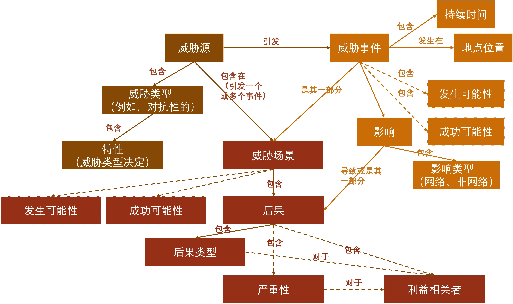
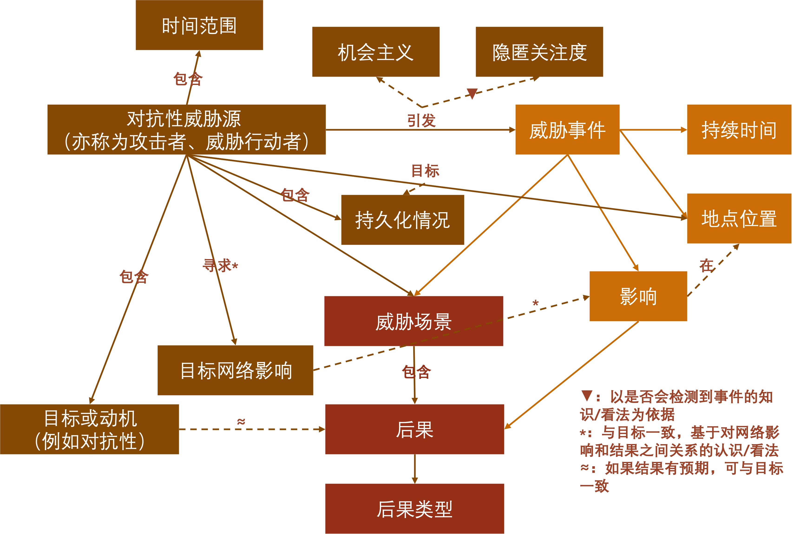

# 5 初始网络威胁模型

&emsp;&emsp;本节介绍了由NGCI Apex计划和关键基础设施领域的组织使用的初始网络威胁模型。首先，在第5.1节中，描述了高级网络威胁建模框架。它标识了关键架构和关系，提供了关键架构的典型值和关系示例，并描述了如何从框架中生成威胁情景。威胁建模框架基于NIST800-30R1框架，对其他框架的材料进行了详细说明和融合，以满足NGCI Apex的需求。关键架构如图16所示。第5.1节中讨论了威胁类型的特征以及这些特征与其他建模架构之间的关系（用虚线标示的架构和关系用以指示与风险建模的关联；这些架构用于风险评估，并且与图15中的系统模型或资产模型有关）。在每个场景下，动词都应修改为“一个或多个;”例如，威胁情景具有一个或多个后果。 

 

 

<b>图16.网络威胁模型的关键架构（未展示对抗性威胁的详细信息）</b>
 

&emsp;&emsp;5.1节以讨论形式介绍了该框架，并提供了一些代表性示例。可以在附录A中找到其他详细信息，该附录A提供了术语、关系和值的定义，或者提供了可以找到值集的参考。 

&emsp;&emsp;在5.2节中，描述了使用该框架构建的初始高级威胁模型。从概念上讲，此威胁模型实例已填充，以展示更完整的实体模型。初始模型将值分配给框架中的某些而非全部架构。 

&emsp;&emsp;5.3节提供了一些代表网络攻击和战役的威胁情景的高级示例。这些示例基于假定的企业IT和运营环境，描述了攻击向量、攻击目标、一些代表性的攻击事件、其网络影响以及这些网络影响与敌对目标的关系。 

## 5.1 建模框架

&emsp;&emsp;问题域的建模框架定义了模型中应包含的关键架构和关系，以使该模型在该域中浅显易懂且有用。一个浅显易懂的模型的使用或可以轻松地转换成利益相关者易于理解的术语，其不仅限于主题专家的专业领域。而有用的模型可以用于产生利益相关者重视的结果的过程或活动中。 

&emsp;&emsp;对于NGCI Apex而言，问题域是对抗性威胁，而这些威胁利用金融服务部门（FSS）实体对网络空间的依赖造成对抗威胁的后果。因此，FSS的网络威胁建模框架必须考虑与FSS实体相关的对手目标和网络攻击的潜在副作用。它还必须支持可用于评估替代技术、架构、流程和过程的模型的开发，尤其是在网络作战的情况下。另外，该框架还必须适应对抗性威胁利用或模拟非对抗性威胁的方式。例如，网络攻击者可以利用自然灾害对正常业务流程进行破坏。对手经常利用人为错误，对手也可能使他们的活动看起来似乎是人为错误或外部系统和基础设施错误造成的影响。 

&emsp;&emsp;最初的关键架构集（用粗斜体表示并在附录A中定义）包括： 

- 威胁源类型： 对抗性、非对抗性（架构故障、人为错误、自然灾害）。威胁特征取决于其类型：
  - 对于对抗性威胁，关键特征是意图、目标和能力。如以下小节所述，其均有多个子特性。
  - 对于对抗源以外的威胁源类别，特征包括影响范围或规模、时间范围和受影响的资产类型。（非对抗性威胁源的类型及其特征在下面的本节中进行了简要说明。 ）
- 威胁事件。这些是由威胁源引起的。威胁源导致威胁事件发生的可能性和可能性取决于威胁源的特征。许多对抗威胁事件可以按照网络攻击生命周期或网络杀伤链模型中的阶段进行分类，且可以与攻击者的能力和受影响的资源类型关联。

&emsp;&emsp;下文更详细的描述了与行为密切相关的非对抗性威胁源的特征。非对抗性威胁源不在第5.2节中初始威胁模型的范围之内，但包含在框架中以支持网络战争场景的开发，在这种情况下，对手将由此类源引起的事件视为机会。 

- 人为错误。此类威胁事件的特征包括：
  - 角色（威胁行动者）：特权用户、普通用户、对设施具有物理访问权限的个人、外部参与者、维护者、开发人员集成商
  - 错误形式：物理动力学错误（如组件电源切断）、系统配置错误、用户输入错误、传输错误值、软件开发错误导致漏洞、集成错误导致漏洞
  - 位置： 请参见影响范围或规模（表11）和资产类型（第5.1.2节） 。
  - 历史频率（如果有）
- 架构故障。请注意，威胁事件通常是根据它们所具有的影响类型（如电源故障，、DNS服务丢失）来描述的。
  - 影响范围或规模：参见表11。
  - 持续时间
  - 历史频率（如果有）
- 自然或广泛的灾难
  - 影响范围或规模。参见表11。
  - 持续时间
  - 历史频率（如果有）

### 5.1.1 对手意图

&emsp;&emsp;对于对抗性威胁，意图的主要子特性包括： 

- 目标或动机。根据威胁模型的预期用途，可以确定主要、次要和其他目标。另外，可以确定对手实现目标后的典型后果。

- 预期的网络影响

- 预期效果的范围或规模

- 时间范围

- 持久化情况（或劝阻对手的轻松程度）

- 隐匿关注度

- 与非对抗性威胁事件相关的机会或协同效应（例如，自然灾害后通过网络钓鱼进行欺骗）

&emsp;&emsp;图17说明了意图的这些方面与其他架构的关系。对于威胁事件，威胁参与者可能会导致发生的可能性（即威胁参与者将选择导致事件的可能性）受对手的时间跨度和与事件相关的持续时间（事件持续时间或暴露持续时间）、对手对隐匿的关注，以及（因为威胁事件是发生了非对手事件的更大威胁场景的一部分，因此）对对手的机会主义的影响。发生的可能性在很大程度上取决于对手对威胁事件可能影响的资源的了解（或看法）。请注意，威胁情景可能具有多种后果，其后果类型不同，并且会影响不同的利益相关者。在某种程度上，可以用对手的目标或动机来识别对手拟造成的后果。 

 

 

<b>图17.对手意图各方面与其他关键架构之间的关系.jpg</b>
 

&emsp;&emsp;下列表格显示了与意图相关的特征的代表值。表9描述了对手目标、网络影响（在表13中定义）和组织后果的关联特征。表10定义了攻击者的时间范围、持续性和隐匿性的代表值，并将这些值与网络攻击生命周期的各个阶段相关联。 

<b>表9.与对手意图有关的特征：目标、网络影响和组织后果</b>

<table>
    <tr>
        <th>对手目标</th>
        <th>典型的网络影响</th>
        <th>典型的组织后果</th>
    </tr>
    <tr>
        <td colspan=3><b>经济利益</b></td>
    </tr>
    <tr>
        <td>• 针对组织的欺诈或盗窃</td>
        <td>损坏、修改或侵入</td>
        <td>财务损失、声誉受损</td>
    </tr>
    <tr>
        <td>• 获取可出售的可用个人身份信息（PII）（例如信用卡号）</td>
        <td>渗透、窃听</td>
        <td>对个人的非身体伤害引起的责任、声誉损害</td>
    </tr>
    <tr>
        <td>• 获取有用的可用竞争信息</td>
        <td>渗透、窃听</td>
        <td>因未履行合同义务而承担的责任、未来竞争优势的丧失</td>
    </tr>
    <tr>
        <td>• 勒索</td>
        <td>降级或中断损坏、修改或侵入、渗透</td>
        <td>财务损失（为避免拒绝服务、破坏性恶意软件如勒索软件、wipers、恶意泄漏的敏感信息等而支付的赎金）</td>
    </tr>
    <tr>
        <td>• 欺诈或盗窃组织的客户、供应商或合作伙伴</td>
        <td>未经授权的使用</td>
        <td>经济损失（通过服务盗窃间接造成的）声誉损失、责任</td>
    </tr>
    <tr>
        <td colspan=3><b>个人动机</b></td>
    </tr>
    <tr>
        <td>• 关注</td>
        <td>损害、中断、破坏、修改或插入</td>
        <td>声誉损失</td>
    </tr>
    <tr>
        <td>• 恶意/怨恨</td>
        <td>损害、中断、破坏、修改或插入</td>
        <td>声誉损失、对个人身体或非身体伤害造成的责任</td>
    </tr>
    <tr>
        <td>• 获取有关目标个人的身份信息（PII）</td>
        <td>渗透、窃听</td>
        <td>声誉损失、对个人的非身体伤害引起的责任</td>
    </tr>
    <tr>
        <td colspan=3><b>地缘政治优势</b></td>
    </tr>
    <tr>
        <td>• 破坏公众对政府或关键基础设施部门的信心</td>
        <td>损害、中断、破坏、修改或插入 渗透、窃听</td>
        <td>对个人身体或非身体伤害、声誉损失</td>
    </tr>
    <tr>
        <td>• 造成经济或政治动荡</td>
        <td>损害、中断、破坏、修改或插入 渗透、窃听</td>
        <td>声誉损失、多个个人或组织的财务损失</td>
    </tr>
    <tr>
        <td>• 恐怖主义</td>
        <td>损害、中断</td>
        <td>对个人身体或非身体伤害、声誉损失</td>
    </tr>
    <tr>
        <td>• 获取信息以改善另一个国家的经济优势</td>
        <td>渗透、窃听</td>
        <td>失去未来竞争优势</td>
    </tr>
    <tr>
        <td>• 获得/使用军事优势</td>
        <td>损害、中断、破坏、修改或插入</td>
        <td>军事任务失败、失去未来军事优势</td>
    </tr>
    <tr>
        <td>• 获得/使用能力以威胁国土安全</td>
        <td>损害、中断、破坏、修改或插入</td>
        <td>国土安全任务失败、未来能力丧失</td>
    </tr>
    <tr>
        <td colspan=3><b>定位/踏脚石</b></td>
    </tr>
    <tr>
        <td>获取针对性攻击的起点</td>
        <td>破坏、修改或插入 未授权使用</td>
        <td>声誉损失、由于对其他实体的伤害而引起的责任</td>
    </tr>
    <tr>
        <td>获取可用于定向攻击的资源（如DDos）</td>
        <td>未授权使用</td>
        <td>声誉损失、由于对其他实体的伤害而引起的责任</td>
    </tr>
    <tr>
        <td>获取有关其他实体的情报</td>
        <td>渗透、窃听</td>
        <td>由于对其他实体的伤害而引起的责任</td>
    </tr>  
</table>

<b>表10.与对手意图有关的特征：时间范围、持续性、隐匿性、CAL阶段</b>
 

<table>
    <tr>
        <th>时间范围</th>
        <th>持续性</th>
        <th>隐匿性</th>
        <th>CAL阶段</th>
    </tr>
    <tr>
        <td>一次性或间断发生的。间断性对抗活动的持续时间是有限的，目的是达到特定的效果或目标——或者确定没有持续的努力就无法达到预期的效果。间断性操作可以是一次性攻击，或者对手可以周期性地执行它们，或者响应触发事件。</td>
        <td>无</td>
        <td>尽管可能担心某些活动源于隐匿性行为，但无需关注</td>
        <td>交付、利用、执行</td>
    </tr>
    <tr>
        <td>间断性的或持续的。持续的攻击活动会持续很长时间（例如几个月到几年）。这要求攻击者投入时间、努力或其他资源。</td>
        <td>有限，具备近期（战术）计划</td>
        <td>关注程度有限，重点在于隐藏存在的证据</td>
        <td>侦查、交付、利用、执行</td>
    </tr>
    <tr>
        <td>持续的</td>
        <td>持久、有计划进行的网络活动</td>
        <td>适度关注，重点在于隐藏存在、TTP和能力</td>
        <td>全部，但武器化功能有限</td>
    </tr>
    <tr>
        <td>持续或持久</td>
        <td>具有战略意义的持久性，并针对多个战役</td>
        <td>高度关注，重点是隐瞒和欺骗，可以使用OPSEC</td>
        <td>所有</td>
    </tr>
    <tr>
        <td>持久。持久的对手活动发生在很长一段时间（数年，或无限制的未来）中，其范围要求对手明确投资策略和实现目标的战略计划。</td>
        <td>具有战略意义的持久性，具有长期规划的多个协调战役</td>
        <td>极其高度关注；可能会使用OPSEC，反情报及伙伴关系或其他关系</td>
        <td>全部，包括多个CAL（例如网络、供应链、物理或动力学的）</td>
    </tr>
</table>

 

### 5.1.2 对抗目标

&emsp;&emsp;如图15所示，对手选择威胁事件的目的是在某个位置造成影响。因此，可以通过位置选择情况来定位目标。对抗目标的两个主要子特征是预期效果的范围或规模以及目标资产的类型。范围或规模与对抗意图的时间范围密切相关。表11列出了Scope/scale的代表值。 

 
<b>表11.影响的范围或规模</b>

| **时间范围**                                                 | **对抗目标的范围或规模**                                     |
| ------------------------------------------------------------ | ------------------------------------------------------------ |
| **非常狭窄的：**小型且定义良好的组织资产集合                 | **组织子集：**对手定位的是一系列组织系统或业务功能的一部分子集（例如面向公众的web服务），从而形成与对手的局部对抗 |
| **狭窄的：**一组共享公共属性或一组属性的组织资产（例如物理位置、操作系统类型等） | **关键组织运营或目标信息：**对手定位的是对组织的运行至关重要的系统、基础设施或业务功能，或者通过结构化形式的活动掌握特定的信息 |
| **广泛的：**属于或可从组织获得的任何或所有资产               | **组织运行及相关：**对手定位的是组织的任何系统、基础设施或业务功能，以及组织的客户、用户或合作伙伴。采用结构化的行动，包括跨越组织结构或多个组织。 |
| **战略性的：**关键基础设施部门、子部门或地理区域             | **部门或社区：**对手定位的是相互以来的关键基础设施或金融服务部门系统，或跨越多个组织以完成业务任务的一组系统。需注意Quantum Dawn exercises[德勤2015]专注于此规模。 |
| **广泛的战略性的：**一个国家或多个关键关键基础设施部门的资产 | **国家或跨国：**对手定位的是对国家或相关基础设施或行业实体至关重要的系统和组织。 |

 

&emsp;&emsp;请注意，范围/规模也适用于防御方：可以在不同范围内制定和执行技术和运营决策。 

&emsp;&emsp;目标资产的类型可以使用“网络防御矩阵”中的五个资产类别（设备、应用、网络、数据和人员），也可以基于以下内容添加类别和子类别：（1）特定机构的企业架构或基于通用架构，例如为NGCI Apex程序和/或（2）功能或业务角色开发的开放系统体系架构（OSA）。特别是，可以为FSS组织定义以下初始子类集： 

- 设备： 企业终端客户端（例如，组织人员使用的台式机、笔记本电脑），专用终端（例如，自动柜员机或ATM），客户终端移动设备（例如，智能手机、平板电脑、客户笔记本电脑）

- 网络： 
  - 网络组件
- 联网设备（例如路由器、交换机、防火墙）
- 网络服务器（例如，域名服务或DNS服务器、目录服务器、动态主机配置协议或DHCP服务器）
- 其他可发现网络设备
  - 企业服务（例如身份和访问管理或IdAM服务）
- 应用：金融交易应用程序、金融交易监控应用程、趋势/历史分析和预测、客户交互应用程序（例如Web、移动），客户关系管理（CRM）应用程序
- 数据：金融服务（FS）数据库（例如帐户数据库）；有关合作伙伴、供应商或客户的数据库或其他知识存储
- 人：企业员工、客户、合作伙伴组织的员工、公众

&emsp;&emsp;这些子类是一个起点，而且并不详尽。对于设备、网络或应用程序来说，资产通过其提供的服务进行标识（例如，使信息可访问）。 

### 5.1.3 对手能力

&emsp;&emsp;可以根据资源（例如专业知识、财务资源、技术资源）、方法和攻击向量来描述对手的能力。表12中显示了五种对手主要的能力的代表值。 

 

表12.对手能力的特征：资源、方法与攻击向量

| **能力** | **资源**                             | **方法与攻击向量**                                           |
| -------- | ------------------------------------ | ------------------------------------------------------------ |
| 获得型   | 攻击者本身的资源或专业知识非常有限。 | 攻击者倾向于采用他人开发的恶意软件、工具、分发机制及策略。攻击者专注于针对组织及其系统或服务提供方的特定网络攻击向量。攻击者也会用有限的人为攻击方式实现侦侦察与欺骗（例如电子邮件、社交媒体）。 |
| 增强型   | 攻击者本身有一些专长及有限的资源。   | 攻击者在已知漏洞和公开可用的恶意软件基础上，开发自己的新恶意软件（例如0day攻击）。攻击者专注于针对组织及其系统或服务提供方的特定网络攻击向量。攻击者也会用有限的人为攻击方式实现侦侦察与欺骗（例如电子邮件、社交媒体）。 |
| 发展型   | 攻击者具有中等程度的资源和专业知识。 | 攻击者挖掘未知漏洞，并利用这些漏洞及其分发机制来开发自己的恶意软件（例如0day攻击）。同时，攻击者也会采购漏洞信息和定制的恶意软件。攻击者专注于针对组织及其系统或服务提供方的特定网络攻击向量。攻击者也会用人为攻击方式实现侦侦察、欺骗、破坏和胁迫。 |
| 先进型   | 攻击者具有较高程度的资源和专业知识。 | 攻击者在设计、开发、制造或收购（供应链）期间“影响”商业产品及服务（或免费和开源软件），使得其可以将漏洞引入此类产品。对攻击者不仅使用针对组织的攻击向量，还使用多种攻击向量对抗其供应商、系统集成商、维护商、合作方、网络及非网络服务的服务提供商（例如电力服务商）。 |
| 综合型   | 攻击者很成熟，资源也很丰富。         | 攻击者会通过集成网络和非网络的攻击线路以创造支持更大、非网络安全的攻击机会。攻击者会在各种更大的攻击面中发掘及加强其脆弱性。攻击者不仅使用针对组织的攻击向量，还使用多种攻击向量对抗其供应商、系统集成商、维护商、合作方、网络及非网络服务的服务提供商（例如电力服务商）。 |

 

&emsp;&emsp;如表12所示，方法使用–并且可以按照–攻击向量进行分类。攻击向量是一种获得网络影响的通用方法，其利用攻击面中某个类型或某个区域的暴露面。[[1\]](#_ftn1)攻击向量可以归类为网络、物理和人为；与目标密切相关；并且是行为的特征。即，给定的行为、攻击事件或使用指定向量的威胁事件。攻击向量的代表值包括：

• 网络攻击向量：供应链、维护环境、外部网络连接、外部共享或基础架构服务、受信任或合作伙伴网络连接、内部网络、内部共享或基础架构服务、内部系统、移动或瞬时连接的设备[[2\]](#_ftn2)、非特权用户的授权操作、特权用户的授权操作、设备端口（例如可移动媒体），数据

• 物理攻击向量：直接物理接近、网络物理接口、间接攻击（例如，对建筑物的动态攻击，篡改供暖、通风和空调[HVAC]）

• 人为攻击向量具有多种属性：

o 被攻击者的角色：特权用户、普通用户、外部参与者、维护者、开发人员集成商

o 对被攻击者的预期影响：胁迫、颠覆、欺骗、失去能力

o 对被攻击者实现预期效果的方法：物理威胁、社交媒体互动、面对面的互动、电子邮件

### 5.1.4 行为或威胁事件

&emsp;&emsp;根据所需的详细程度，可以从不同的资源中获取威胁事件信息。可以从NIST SP 800-30R1中获取更多常规威胁事件；可以从ATT＆CK和CAPEC得出更具体的对抗威胁事件或行为。威胁事件和行为与威胁源的特征有关。例如，与CAL阶段相关的威胁事件仅与攻击包括该阶段的对手有关；与某一特定攻击向量相关的威胁事件只有在该攻击向量被列入攻击发生的技术和操作环境的模型或假设集时，才会被列入威胁模型。威胁事件会发生在一个或多个位置（请参阅第5.1.2节），并且可能持续一段时间。威胁事件具有一种或多种影响，可能是网络影响或非网络影响。表13中展示了从[Temin 2010]改编的一组可能的网络影响。[[3\]](#_ftn3)请注意，其指定的事件可以具有多种影响，具体取决于描述该影响的架构视图。例如，将勒索软件引入OS是从OS视图切入，但修改行为则是由系统的视图而来，而随后触发勒索软件会产生网络中断的影响。

 

表13.网络影响

| **网络影响**         | **描述**                                               | **相关安全目标** |
| -------------------- | ------------------------------------------------------ | ---------------- |
| 损害                 | 系统或组件的性能或有效性降低                           | 可用性           |
| 中断                 | 失去使用网络资产的任何能力                             | 可用性           |
| 破坏                 | 现有信息、数据、协议或软件的变化，使其无法使用或不可靠 | 可用性/完整性    |
| 修改                 | 更改现有信息、数据、协议或软件                         | 完整性           |
| 捏造（或插入）       | 将新信息、数据或软件引入系统                           | 完整性           |
| 未授权使用（或篡改） | 违反策略使用系统资源                                   | 责任             |
| 窃听                 | 获得对系统内或从系统传输的信息的访问                   | 保密性           |
| 渗透                 | 未经授权传输或从系统中删除信息                         | 保密性           |

 

### 5.1.5 威胁场景

&emsp;&emsp;可以通过多种方式来开发网络作战、风险评估或技术评估的威胁情景，具体取决于作战行动的规模、风险评估的范围或要评估的技术的假定环境等因素。场景开发的起点包括：

• 历史事件。可以使用特定于演习环境的术语来总结或概真实事件（例如，选择特定于系统环境的攻击事件）。现实事件可以来自其他部门（例如，对目标公司的攻击、对Dyn的DDoS攻击）以及金融服务部门（例如，对全球银行间金融电信协会[SWIFT]的攻击）顾客）。基于历史事件的场景的范围可以从非常狭窄到战略范围不等。

• 在某些大规模演习中，假定会出现部门范围的攻击。这些可以聚焦于对共享基础架构或服务的攻击（例如，用于FSS的SWIFT），在广泛部署的技术中利用零日攻击或对特定关键机构的攻击（例如，对大型金融机构的DDoS攻击，会在整个FSS系统上产生连锁反应））。这种类型的方案侧重于战略规模，并且还可以涵盖广泛的范围（给定的机构及其合作伙伴、客户和供应商） 。

• 对特定资产（服务、数据库）的不利网络影响，将成为故障树分析的起点。这种类型的场景范围可能非常窄或很窄。

&emsp;&emsp;威胁情景中的详细程度取决于为作战活动的某些属性（例如业务功能、系统环境以及防御性网络技术和状态）提供或假定的详细程度。

## 5.2 初始代表威胁模型

&emsp;&emsp;本节使用第5.1节中的框架描述了为NGCI Apex程序开发的高级威胁模型。这种最初的代表性威胁模型仅限于对抗性威胁。（如果想要或需要，将来的版本可能会考虑对抗性威胁与非对抗性威胁之间的相互作用。）

### 5.2.1 对手特征

&emsp;&emsp;该威胁模型的一个关键假设是，FSS机构必须为应对这些威胁做好准备。必须由政府实体解决的威胁不在此列。特别是，此威胁模型不包括民族国家赞助的军事团体或恐怖团体，无论是否与民族国家保持一致。请注意，当恐怖组织积极寻求经济利益时，它是在从事犯罪活动而不是实施恐怖主义。表14从表9中选择对手目标，确定典型参与者，并确定对抗活动的典型目标。

 

表14.对手目标、典型参与者和典型目标

| **对手目标**                                                 | **典型参与者**                                               | **典型目标**                                                 |
| ------------------------------------------------------------ | ------------------------------------------------------------ | ------------------------------------------------------------ |
| **经济利益**                                                 |                                                              |                                                              |
| •      对组织的欺诈或盗窃                                    | 内部人员、犯罪分子（个人或有组织的团体）                     | 金融服务（FS）数据库（修改或插入数据）；身份与访问管理（IdAM）服务（获得/提升权限） |
| •      获取可出售/可用的PII（例如信用卡号）                  | 内部人员、犯罪分子（个人或有组织的团体）                     | 金融服务数据库；身份与访问管理（IdAM）服务                   |
| •      获取可出售/可用的竞争信息                             | 内部颠覆或内部破坏者、代表竞争对手或内幕交易客户寻求此类信息，或出售给竞争对手或内幕交易客户的犯罪份子（个人或有组织的团体） | 金融服务数据库；预测应用程序和数据库；战略规划数据存储       |
| •      勒索                                                  | 内部人员、犯罪分子（个人或有组织的团体）                     | 网络组件（拒绝服务[DoS]威胁）；金融服务数据库及应用（通过勒索软件威胁损毁/加密数据的威胁） |
| •      对组织的客户、供应商及合作伙伴的欺诈或盗窃            | 内部人员、犯罪分子（个人或有组织的团体）                     | 金融服务数据库（有关客户的信息）；合伙或购买中使用的数据库或其他交易数据存储 |
| **个人动机**                                                 |                                                              |                                                              |
| •      关注                                                  | 黑客、尾随者、“脚本小子”；上述有不满意图的小团体             | 网络组件（拒绝服务[DoS]威胁）；面向外部的服务和数据（DOS，捏造） |
| •      恶意/怨恨                                             | 心怀不满的内部人士或前内部人士；黑客、尾随者、“脚本小子”；上述有不满意图的小团体 | 网络组件（拒绝服务[DoS]威胁）；面向外部的服务和数据（DOS，捏造） |
| •      获取有关目标个人的个人识别信息（例如财富、财富来源或财富分配） | 内部破坏者；犯罪分子（个人或有组织的团体）；跟踪者           | 金融数据库（有关客户的信息）；人力资源数据库（有关员工的信息，这些信息可被用来伪装或伪装成影响他们） |
| **地缘政治优势**                                             |                                                              |                                                              |
| •      破坏公众对金融服务业的信心                            | 政治或意识形态活动家；民族国家联盟专业犯罪企业               | 网络组件（DOS）；对外的服务和数据（DoS、制造）；金融服务数据库和服务（DOS、损坏）；金融服务交易数据 |
| •      造成经济或政治动荡                                    | 政治或意识形态活动家；民族国家联盟专业犯罪企业               | 网络组件（DOS）；向外的服务和数据（Do S、制造）；金融服务数据库和服务（DOS、损坏）；金融服务交易数据（DOS、损坏）--尤其是部门基础架构和共享服务 |
| •      获取信息改善另外一个国家的经济优势                    | 民族国家联盟的专业犯罪企业                                   | 金融服务数据库；预测应用程序和数据库；战略计划数据存储       |
| **位置性**                                                   |                                                              |                                                              |
| •      针对其他实体的针对性攻击的发动点                      | 内部人员；犯罪分子（个人或有组织的团体）                     | 网络组件                                                     |
| •      获取有关其他实体（例如企业）的情报                    | 内部人员，犯罪分子（个人或有组织的团体）                     | 合伙或购买中使用的数据库或其他交易数据存储                   |

 

&emsp;&emsp;关于时间间隔、持久性、隐匿性和网络攻击生命周期的阶段，威胁模型仅限于表10的前四行。范围/规模从非常狭窄到战略性（整个行业范围的影响，尤其是通过对金融基础设施服务例如联合清算的攻击），但不包括广泛的战略性的。能力包括获得型、增强型和发展型，还包括先进型的能力；将来可能会考虑使用更高级的方法。排除物理和人为攻击向量；网络攻击向量包括维护环境、外部网络连接、受信任或合作伙伴网络连接、内部网络、非特权用户的行为、特权用户的行为、设备端口（例如，可移动媒体）和数据。

### 5.2.2 敌对行为和威胁事件

&emsp;&emsp;表15列出了一组初始的对手行为和与对手相关的威胁事件。这些主要来自NIST SP 800-30R1，但已针对具有上述特征的对手进行了定制裁剪。有关攻击向量和网络影响的信息已添加到NIST SP 800-30R1事件描述中。（阴影表示该事件来自NIST SP 800-30R1。一些其他事件基于其他框架，尤其是ODNI CTF和ATT＆CK被包括在内；这些行未添加阴影标识。）额外的剪裁可能会使这些描述对FSS环境更有意义。

&emsp;&emsp;最后一栏说明了如何使用矩阵方法将事件标识用于技术分析和搜寻。如1.2.3节所述，CART在网络防御矩阵中确定了四个特别重要的单元：网络标识（N-I），网络检测（N-D），数据保护（D-P）和数据检测（D-D）。表15指出了是否可以通过识别可能成为目标的网络可发现资源，保护数据资源或检测针对网络或数据资源的恶意活动，来降低威胁事件成功的可能性或其后果的严重性。

 

**表15.对手行为和威胁事件**

| **CAL****阶段** | **敌对行为或威胁事件**                                       | **攻击向量**                                                 | **网络影响**                                 | **选定的矩阵单元格** |
| --------------- | ------------------------------------------------------------ | ------------------------------------------------------------ | -------------------------------------------- | -------------------- |
| 侦查            | 执行外围网络侦查/扫描                                        | 外部网络连接                                                 | 拦截                                         | N-I                  |
| 侦查            | 对暴露的网络执行网络嗅探。                                   | 外部网络连接  内部网络（当CAL递归应用）                      | 拦截                                         | N-I                  |
| 侦查            | 对组织网络连接到的外部网络（例如ISP）进行网络嗅探连接。      | 外部网络连接                                                 | 拦截                                         | N-I                  |
| 侦查            | 根据网络嗅探分析网络流量。                                   | 外部网络连接  内部网络（当CAL递归应用）                      | 拦截                                         | N-I                  |
| 侦查            | 使用组织信息的开源发现来收集信息。                           | 公开信息，社交媒体互动                                       | 拦截                                         |                      |
| 侦查            | 对目标组织进行侦查和监视。                                   | 物理观察，社交媒体互动，面对面互动，电子邮件，位置跟踪       | 拦截                                         |                      |
| 侦查            | 执行针对恶意软件的内部侦查。                                 | 维护环境，特权用户，可信或合作伙伴网络的操作连接             | 拦截                                         | N-I，N-D             |
| 武器化          | 进行网络钓鱼攻击。                                           | 外部网络连接，电子邮件                                       | （没有立即影响）                             |                      |
| 武器化          | 制作鱼叉式网络钓鱼攻击。                                     | 外部网络连接，电子邮件                                       | （无立即影响）                               |                      |
| 武器化          | 对关键员工进行心理操纵攻击。                                 | 社交媒体互动                                                 | （无立即影响）                               |                      |
| 武器化          | 专门基于已部署的信息技术环境进行攻击。                       | 外部网络连接，受信任的或伙伴网络连接                         | （无立即影响）                               |                      |
| 武器化          | 创建假冒/欺骗网站                                            | 外部网络连接                                                 | （没有立即效果）                             | N-D                  |
| 武器化          | 进行伪造证书。                                               | 外部网络连接，受信任或合作伙伴网络连接                       | （无立即影响）                               | N-D                  |
| 武器化          | 创建并运营虚假的前台组织，以将恶意组件注入供应链。           | 供应链                                                       | （无立即影响）                               |                      |
| 武器化          | 破坏另一个组织中的系统以在进入供应链                         | 供应链                                                       | （无立即影响）                               |                      |
| 投递            | 建立或使用与企业整体或目标系统的通信渠道。                   | 外部网络连接，受信任的或伙伴网络连接                         | （无立即影响）                               | N-D                  |
| 投递            | 将命令传递到目标系统（例如，登录）                           | （无立即影响）                                               | 未经授权的使用                               | N-D                  |
| 投递            | 将已知的恶意软件发送到内部组织信息系统（例如，通过电子邮件发送病毒）。[请参阅CTF：与预期的受害者互动] | 外部网络连接，电子邮件                                       | 损坏、修改或插入                             | N-D                  |
| 投递            | 将修改后的恶意软件交付给内部组织信息系统。[请参阅CTF：与预期受害者互动] | 内部网络，非特权用户的授权操作，特权用户的授权操作，设备端口（例如可移动设备） | 损坏、修改或插入                             | N-D                  |
| 投递            | 提供针对性的恶意软件，以控制内部系统和数据泄漏               | 内部网络、非特权用户的授权操作、特权用户的授权操作、设备端口（例如可移动设备） | 损坏、修改或插入                             | N-D                  |
| 投递            | 通过提供可移动媒体来传播恶意软件。                           | 非特权用户的授权操作、特权用户的授权操作、设备端口（例如可移动设备） | 损坏、修改或插入                             |                      |
| 投递            | 在可下载软件和/或商业信息技术产品中插入无目标的恶意软件。    | 供应链                                                       | 损坏、修改或插入                             |                      |
| 投递            | 将目标恶意软件插入组织信息系统和信息系统组件。               | 供应链、维护环境                                             | 损坏、修改或插入                             |                      |
| 投递            | 基于系统配置将专用恶意软件插入的组织信息系统中。             | 供应链、维护环境                                             | 损坏、修改或插入                             |                      |
| 投递            | 将伪造或篡改的硬件插入供应链。                               | 供应链                                                       | 损坏、修改或插入                             |                      |
| 投递            | 将篡改的关键组件插入组织系统。                               | 供应链、维护环境                                             | 腐败、修改或插入                             |                      |
| 投递            | 破坏外部使用并重新引入企业的信息系统或设备。                 | 移动或临时连接的设备                                         | 未经授权进行的损坏、修改或插入               | N-D                  |
| 传递/利用       | 在组织控制的信息系统或网络上安装通用嗅探器。                 | 内部网络，特权用户的授权操作，设备端口（例如可移动设备媒体） | 修改或插入                                   | N-D                  |
| 传递/利用       | 在组织信息系统和网络上安装持久性和针对性的嗅探器。           | 内部网络，特权用户的授权操作，设备端口（例如可移动设备媒体） | 修改或插入                                   | N-D                  |
| 传递/利用       | 将恶意扫描设备（例如无线嗅探器）插入设施内部。               | 即时物理接近                                                 | 修改或插入                                   | N-D                  |
| 利用            | 利用授权员工的物理访问路径获得进入组织设施的渠道。           | 即时物理接近                                                 | （无立即影响）                               |                      |
| 利用            | 利用配置不当或未经授权的信息系统来暴露给Internet。           | 外部网络连接                                                 | 损坏、修改或插入                             | N-D                  |
| 利用            | 利用终端用户系统上的分离隧道来获取访问权限企业系统。         | 外部网络连接，终端用户系统                                   | 渗透、拦截                                   | N-D                  |
| 利用            | 获取合法账户。[请参阅CTF]                                    | 外部网络连接                                                 | （没有立即效果）                             |                      |
| 利用            | 利用移动系统（例如，笔记本电脑、PDA、智能手机）中的已知漏洞。[请参阅CTF：建立非法用户访问权限] | 移动或临时连接的设备                                         | 破坏、拦截                                   | N-D                  |
| 利用或控制      | 利用最近发现的漏洞。[请参阅ATT&CK：横向运动]                 | 外部网络连接，受信任或伙伴网络连接，内部网络                 | 破坏、修改、或插入未经授权的使用             | N-D                  |
| 控制            | 获取与用户帐户、进程、服务或域关联的特权。[请参阅ATT&CK：凭据访问] | 内部网络、内部共享或基础架构服务                             | 未经授权的使用                               |                      |
| 控制            | 修改或增加与用户帐户、进程、服务或域关联的特权。[请参阅ATT&CK：特权升级] | 内部网络、内部共享或基础架构服务                             | 修改或插入                                   |                      |
| 控制            | 进行内部侦察。[请参阅ATT&CK：发现；通过安装嗅探器、获取特权或修改权限] | 内部网络、内部共享或基础架构服务                             | 拦截                                         | N-D                  |
| 控制            | 在云环境中利用多租户。[见ATT&CK：横向运动；利用获取合法帐户] | 内部共享或基础架构服务                                       | 破坏、拦截                                   |                      |
| 控制            | 利用内部组织信息系统上的漏洞。[请参阅ATT&CK：横向运动]       | 外部网络连接、受信任或伙伴网络连接、内部网络                 | 未经授权进行的损坏、修改或插入               | N-D                  |
| 控制            | 使用零日攻击来利用漏洞。[请参阅ATT&CK：横向运动]             | 外部网络连接、受信任或伙伴网络连接、内部网络、移动或即时连接设备 | 损坏、修改或插入未经授权的使用               | N-D                  |
| 控制或执行      | 根据组织业务/业务运作的节奏，利用信息系统中的漏洞。          | 外部网络连接、受信任或伙伴网络连接、内部网络                 | 降级、中断、损坏、修改或插入  未经授权的使用 | N-D                  |
| 控制            | 在多租户环境中利用不安全或不完整的数据删除。                 | 外部网络连接、受信任或伙伴网络连接、内部网络、内部共享或基础设施服务 | 渗透、拦截                                   | D-P                  |
| 控制            | 在多租户环境中违反隔离。                                     | 内部共享或基础架构服务                                       | 降级、中断、渗透、拦截                       | D-P                  |
| 控制            | 建立通往恶意软件或受感染组件的命令和控制（C2）通道。[请参阅ATT&CK：命令和控制] | 外部网络连接、受信任或伙伴网络连接、内部网络、内部共享或基础设施服务 | 损坏、修改或插入未经授权的使用               | N-D                  |
| 控制            | 采取反IDS措施。[见CTF；请参阅ATT&CK：防御逃避]               | 内部网络、内部共享或基础架构服务                             | 修改、插入                                   | N-D                  |
| 控制            | 采取反取证措施。[见CTF：请参阅ATT&CK：防御逃避]              | 内部网络、内部共享或基础架构服务、内部系统                   | 修改、插入                                   | N-D                  |
| 控制            | 通过物理访问损害关键信息系统。                               | 即时物理接近                                                 | 降级、中断、损坏、修改或插入未经授权的使用   |                      |
| 控制            | 破坏组织关键信息系统的软件。                                 | 维护环境、内部网络、内部共享或基础架构服务、特权用户的授权操作、设备端口 | 损坏、修改或插入未经或授权的使用             | N-D                  |
| 控制            | 损害组织信息系统以促进数据/信息的泄漏。[请参阅CTF：在受害人电脑、信息系统、网络及/或数据存储上重新定位及存储数据] | 维护环境、内部网络、内部共享或基础架构服务、特权用户的授权操作、设备端口 | 损坏、修改或插入未经授权的使用、渗透、拦截   | N-D                  |
| 控制            | 分级数据以进行渗透。[请参阅CTF：在受害人电脑、信息系统、网络及/或数据存储上重新定位及存储数据；请参阅ATT&CK：收集] | 内部网络、内部共享或基础架构服务、内部系统                   | 插入                                         | D-P，D-D             |
| 控制            | 破坏对任务业务功能至关重要的信息。                           | 内部网络、内部共享或基础架构服务、非特权用户的授权操作、特权用户的授权操作、设备端口、数据 | 损坏、修改或插入                             | D-P，D-D             |
| 执行            | 通过外部网络的网络嗅探获取敏感信息。[看到ATT&CK：集合]       | 外部网络连接、受信任或合作伙伴网络连接                       | 拦截                                         | D-P                  |
| 执行            | 导致攻击者选择的服务降级或拒绝服务。[请参阅CTF：拒绝访问]    | 内部网络、内部共享或基础架构服务、已授权特权用户的动作       | 降级、中断                                   | N-D                  |
| 执行            | 导致关键信息系统组件和功能的恶化或破坏。[请参阅CTF：销毁硬件软件数据] | 内部网络、内部共享或基础架构服务、特权用户的授权操作         | 降级、中断                                   | N-D                  |
| 执行            | 通过在可公开访问的信息系统（例如网络）上创建、删除和/或修改数据来造成完整性损失。 | 外部网络                                                     | 损坏、修改或插入                             | D-P、D-D             |
| 执行            | 通过污染或破坏关键数据而导致完整性损失。[请参阅CTF：更改受害者系统上的数据] | 内部网络、内部共享或基础架构服务、特权用户的授权操作、非特权用户、数据 | 损坏、修改                                   | D-P、D-D             |
| 执行            | 通过将错误但可信的数据注入组织信息系统而导致完整性损失。     | 内部网络、内部共享或基础架构服务、特权用户的授权操作、非特权用户、数据 | 插入                                         | D-P、D-D             |
| 执行            | 通过干扰通信来降低或拒绝可用性。                             | 外部网络、受信任或合作伙伴网络连接、内部网络                 | 降级、中断                                   | N-D                  |
| 执行            | 导致授权用户泄漏关键和/或敏感的敏感信息。                    | 内部网络、内部共享或基础架构服务、特权用户的授权操作、社会工程学 | 渗透、拦截                                   | N-D                  |
| 执行            | 通过敏感信息溢出导致未经授权的披露和/或不可用。              | 内部网络、内部共享或基础架构服务、特权用户的授权操作、社会工程学 | 渗透、拦截                                   | N-D                  |
| 执行            | 将敏感信息从内部网络秘密的传输到外部目标。[请参阅CTF：泄漏数据/信息和ATT&CK：渗透] | 外部网络、受信任或合作伙伴网络连接、内部网络                 | 渗透                                         | N-D                  |
| 执行            | 注入精心设计的网络流量。                                     | 外部网络、受信任或合作伙伴网络连接、内部网络                 | 损坏、修改或插入                             | N-D                  |
| 执行            | 将邮件发送到目标范围的外围网络地址以拒绝服务。               | 外部网络、可信或合作伙伴网络连接                             | 降级、中断                                   | N-D                  |
| 执行            | 将敏感信息下载到外部使用的信息系统或设备中，然后重新引入到企业。 | 内部网络                                                     | 渗透、拦截                                   | D-P                  |
| 执行            | 通过外部拦截获得信息无线网络流量。                           | 内部网络                                                     | 拦截                                         |                      |
| 执行            | 获得未经授权的访问。                                         | 内部网络、内部共享或基础架构服务、特权用户的授权操作、非特权用户、社会工程学 | 未经授权的使用                               | N-D                  |
| 执行            | 通过公开访问的信息系统获取敏感数据/信息。                    | 外部网络                                                     | 渗透、拦截                                   |                      |
| 执行            | 通过机会性地窃取或清除信息系统/组件来获取信息。              | 供应链、维护系统                                             | 渗透、拦截                                   |                      |
| 保持            | 混淆对手的行为。[请参阅ATT&CK：逃避防御]                     | 内部网络、内部共享或基础架构服务、已授权特权用户的动作       | 损坏、改造                                   | N-D                  |

 

&emsp;&emsp;下一级别的威胁模型将基于有关操作和技术环境的既定假设。关于运行环境的假设可以包括识别关键任务或业务功能、支持任务以及完成这些任务所需的网络资源；可以采取防御行动或技术变革的范围或规模；以及网络决策的管理或治理架构（尤其是集中决策）。关于技术环境的假设可以包括识别产品、产品套件或针对被视为目标的资源类别和子类别的标准。

&emsp;&emsp;在下一详细级别，与表15中CAL和NIST SP 800-30R1提供的威胁事件分类不同的威胁事件分类可能更有用。例如，请参阅第2.1.5.3节中讨论的关于内部威胁和供应链威胁的CAPEC， ATT＆CK和CAL模型。

## 5.3 构建代表性威胁场景

&emsp;&emsp;少量高度通用的威胁场景可以作为开发更详细但与机构无关的场景的起点。这些是： [[4\]](#_ftn4)

1. 泄漏：对手从机构的系统中获取敏感信息。这种场景包括个人身份信息（PII）的数据泄露，以及专有信息、商业秘密或其他高度敏感信息的大规模泄露。
2. 欺诈：对手修改或伪造该机构系统上的信息，使该机构能够按对手的指示支付资金或转移其他资产。此方案侧重于由网络攻击引起的欺诈性交易，不包括由非网络方法引起的欺诈。
3. 滥用：对手修改或伪造软件或机构系统的配置数据，以便攻击者可以使用（通常用于转售容量，例如僵尸网络农场或加密货币挖矿）。此场景的重点是占用资源，这通常是高度秘密的。
4. 破坏：对手修改或破坏机构资产，以防止机构完成其主要业务功能。这种情况包括对手拒绝、破坏或损毁业务运营。
5. 友军之火：对手欺骗业务区域经理或网络防御人员，使其采取破坏性的行动。此场景聚焦于修改或捏造业务或配置数据，以及业务功能的修改或中断。
6. 上游攻击：对手会损害供应商或合作伙伴，以增加机构的被攻击的脆弱性。这种场景包括对合作伙伴机构以及机构供应链中的机构的攻击。
7. 名誉损害：对手破坏机构的运作或捏造机构向其选区提供的信息，从而损害其声誉和对选区的信任。这种场景与涉及破坏或拒绝执行业务职能的情况密切相关，但也包括以破坏机构信心的方式修改不重要但外部可见的信息或服务。
8. 阶梯式攻击：攻击者破坏了机构的系统，以攻击下游实体（例如，客户、客户的客户）。如同前述的场景，该场景与涉及业务功能中断的情况有关。但是，它也与涉及获取敏感信息或欺诈性交易的场景有关。
9. 勒索：攻击者为了获取经济利益而修改或丧失业务资产（例如勒索软件、分布式拒绝服务（DDoS）攻击）。此场景与出于欺诈目的以及为了破坏或拒绝业务功能而涉及修改的场景密切相关。

&emsp;&emsp;对于每种通用场景，可以确定典型的威胁参与者及其最终目标，以及在攻击过程中必须被连累的典型中间目标。

&emsp;&emsp;下表列出了从NIST SP 800-30R1派生的代表攻击或活动的典型构建模块。通过选择和定制表15中所示的攻击事件，并添加与针对FSS组织的目标相关的详细信息，可以详细说明这些摘要。下一级别的细节可以利用CAPEC和ATT＆CK的材料。

 

**表16.威胁场景的构建模块**

| **类型** | **方法**                                                     | **典型事件或行为**                                           | **网络影响**                 |
| -------- | ------------------------------------------------------------ | ------------------------------------------------------------ | ---------------------------- |
| 实施攻击 | 进行通信拦截攻击。                                           | 执行外围网络侦查/扫描。  对暴露的网络执行网络嗅探。          | 拦截                         |
| 实施攻击 | 进行无线干扰攻击。                                           | 执行外围网络侦查扫描。  对暴露的网络执行网络嗅探。  通过阻塞通信来降低或拒绝可用性。 | 降级、中断                   |
| 实施攻击 | 使用未经授权的端口、协议和服务进行攻击。                     | 执行外围网络侦查扫描。  对暴露的网络执行网络嗅探。  利用暴露在Internet的配置不当或未经授权的信息系统。 | 降级、中断                   |
| 实施攻击 | 利用允许跨边界移动的通信/数据进行攻击。                      | 建立通往恶意软件或受感染组件的命令和控制（C2）通道。  损害组织信息系统以促进数据/信息的泄漏。  导致授权用户泄漏关键和/或敏感信息。或泄漏敏感信息导致未经授权的泄漏和/或服务不可用。或将敏感信息从内部网络秘密的传输到外部目标。 | 降级、中断、渗透、拦截       |
| 实施攻击 | 进行简单的拒绝服务（DoS）攻击。                              | 执行外围网络侦查/扫描。                                      | 降级、中断                   |
| 实施攻击 | 进行分布式拒绝服务（DDOS）攻击。                             | 执行外围网络侦查/扫描。  将消息发送到目标范围的外围网络地址以导致拒绝服务。 | 降级、中断                   |
| 实施攻击 | 进行有针对性的拒绝服务（DOS）攻击。                          | 在组织信息系统和网络上安装持久性和针对性的嗅探器。  导致攻击者选择的服务和功能降级或拒绝服务。 | 降级、中断                   |
| 实施攻击 | 对组织设施进行物理攻击。                                     | （取决于组织设施的物理特征）                                 | 降级、中断                   |
| 实施攻击 | 对支持组织设施的基础架构进行物理攻击。                       | （取决于支持基础架构的物理特征）                             | 降级、中断                   |
| 实施攻击 | 对组织机构进行网络物理攻击。                                 | （取决于组织机构的网络物理特征）                             | 降级、中断                   |
| 实施攻击 | 在云环境中进行数据清理攻击。                                 | 建立通往恶意软件或受感染组件的命令和控制（C2）通道。  在多租户环境中利用不安全或不完整的数据清理。或在多租户环境中违反隔离。 | 渗透、拦截                   |
| 实施攻击 | 进行暴力登录尝试/进行密码猜测攻击。                          | 建立或使用与企业整体或目标系统的通信渠道。  将命令传递到目标系统（例如，登录）。 | 未经授权的使用               |
| 实施攻击 | 进行非目标的零日攻击。                                       | （取决于企业架构）                                           | 所有                         |
| 实施攻击 | 进行基于外部的会话劫持。                                     | 对暴露的网络执行网络嗅探。                                   | 拦截                         |
| 实施攻击 | 进行基于内部的会话劫持。                                     | 对暴露的网络执行网络嗅探。  执行针对恶意软件的内部侦查。     | 拦截                         |
| 实施攻击 | 进行基于外部的网络流量修改（中间人）攻击。                   | 对组织网络所连接的外部网络（例如ISP）执行网络嗅探。  根据网络嗅探分析网络流量。  注入精心设计的网络流量。 | 降级、中断、损坏、修改或插入 |
| 实施攻击 | 进行基于内部的网络流量修改（中间人）攻击。                   | 根据网络嗅探分析网络流量。  注入精心设计的网络流量。         | 降级、中断、损坏、修改或插入 |
| 实施攻击 | 进行基于外部人员的社会工程以获得信息。                       | 使用组织信息的公开源来收集信息。  对关键人员进行心理操纵攻击。 | 渗透、拦截                   |
| 实施攻击 | 进行基于内部人员的社会工程以获得信息。                       | 对关键人员进行心理操纵攻击。                                 | 渗透、拦截                   |
| 实施攻击 | 进行针对关键员工的个人设备的攻击，并对其进行破坏。           | 使用组织公开源信息来收集信息。  制作鱼叉式网络钓鱼攻击。或创建假冒伪劣网站。  利用移动系统（例如，笔记本电脑、PDA、智能手机）中的已知漏洞。  损害外部使用并重新引入企业的信息系统或设备。  损害组织信息系统以促使数据信息的泄漏。或将敏感信息下载到外部使用并重新引入企业的信息系统或设备中。 | 损坏、修改或插入、渗透、拦截 |
| 实施攻击 | 进行针对和利用关键硬件、软件或固件的供应链攻击。             | 使用组织公开源信息来收集信息。  创建并运营虚假的前台组织，以将恶意组件注入供应链。或损害另一个组织中的系统以在供应链中建立业务。  将伪造或篡改的硬件插入供应链。 | 损坏、修改或插入             |
| 协同战役 | 协调多阶段攻击（例如条约攻击）。                             | 将目标恶意软件插入组织信息系统和信息系统组件。  利用内部组织信息系统上的漏洞。 | 所有                         |
| 协同战役 | 协调将跨多个信息系统和信息技术的内部和外部攻击结合在一起的活动。 | [其他方案可以用作构建模块]                                   | 所有                         |
| 协同战役 | 协调多个组织中的活动以获取特定信息或取得期望的结果。         | 损害合作伙伴组织中的系统。或危害外部使用并重新引入企业的信息系统或设备。或损害另一个组织中的系统以在供应链中建立业务。  建立或使用与企业整体或目标系统的通信渠道。  将目标恶意软件插入组织信息系统和信息系统组件。 | 所有                         |
| 协同战役 | 协调一个活动，将攻击从现有组织传播到整个组织系统。           | 建立通往恶意软件或受感染组件的命令和控制（C2）通道。  在多租户环境中违反隔离。或利用内部组织信息系统上的漏洞。 | 所有                         |
| 协同战役 | 在详细监视的基础上，协调持续、适应性和不断变化的网络攻击活动。 | [其他方案可以用作构建模块]                                   | 所有                         |
| 协同战役 | 使用外部（外部人员）、内部（内部人员）和供应链（供应商）攻击向量来协同网络攻击。 | [其他方案可以用作构建模块]                                   | 所有                         |

 

------

[[1\]](#_ftnref1) At a minimum, the term “attack surface” refers to “accessible areas where weaknesses or deficiencies in information systems (including the hardware, software, and firmware components) provide opportunities for adversaries to exploit vulnerabilities.” [NIST 2013] While some uses of the term focus on externally exposed vulnerabilities, the assumption that an adversary will penetrate an organization’s systems means that internal exposures – vulnerabilities which can be reached by lateral movement within a system or infrastructure – are also part of the attack surface. Conceptually, the term can also cover aspects of the operational, development, and maintenance environments that an adversary can reach and that could contain vulnerabilities.

至少，术语“攻击面”指的是“攻击者可利用包含弱点或缺陷的信息系统（包括硬件、软件和固件组件）来创造挖掘漏洞机会的可达区域”。[NIST 2013]虽然该术语的一些用法侧重于外部暴露的漏洞，但假设对手将渗透一个组织的系统意味着内部暴露——在系统或基础设施内横向移动可以达到的漏洞——其也是攻击面的一部分。 从概念上讲，这个术语还可以涵盖对手可能触及的操作、开发和维护环境，这些环境也可能包含漏洞。

[[2\]](#_ftnref2) These include, for example, personal devices allowed under a bring-your-own-device (BYOD) policy.这些包括，例如，在自带设备（BYOD）策略允许下的个人设备

[[3\]](#_ftnref3) Table13 differs from [Temin 2010]in several ways: Insertion is offered as an alternative to Fabrication; Usurpation is offered as an alternative to Unauthorized use; Accountability is offered as a security objective corresponding to Unauthorized; and Corruption and Exfiltration are added.

表13与[Temin 2010]的不同之处在于：插入是捏造的一种替代方法；篡改可作为未经授权使用的替代方法；问责是与未经授权使用相对应的安全性目标；并且添加了破坏和渗透。

[[4\]](#_ftnref4) 此列表改编自[Bodeau 2017]。